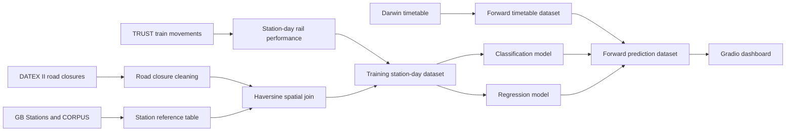

# Road-Rail Resilience

A proof-of-concept machine learning project for detecting whether unplanned road closures on the Strategic Road Network and Major Road Network are associated with rail performance degradation at nearby stations.

The project integrates open UK road and rail datasets, builds a station-day modelling dataset and presents the results through a Gradio dashboard for operational exploration.

## Project Summary

Road and rail disruption data are usually managed in separate systems. National Highways publishes road closure data through DATEX II feeds, while Network Rail and the Rail Delivery Group publish train movement and timetable data through TRUST and Darwin. This project links those sources to examine whether road closures within 10 to 25 kilometres of a rail station can act as a useful signal for predicting station-level rail delay.

The final modelling task is defined at station-day level. A station-day is labelled as disrupted when the mean arrival delay is greater than five minutes. The project uses a supervised binary classification model to predict disruption risk and a complementary regression model to estimate expected delay magnitude.

The main output is not only the model. A central contribution is the reusable data pipeline that joins DATEX II road closure data, TRUST train movement data, Darwin timetable data, GB station coordinates and CORPUS rail identifier mappings.

## Key Features

- Ingests and processes National Highways DATEX II road closure records
- Processes Network Rail TRUST movement data for station-level delay analysis
- Parses Darwin timetable data for forward prediction
- Resolves station identifiers using CORPUS and GB Stations reference data
- Links road closures to stations using a 10 to 25 km haversine distance band
- Builds station-day features covering closure attributes, spatial severity, lag effects and temporal patterns
- Trains classification and regression models using XGBoost and comparator models
- Presents predictions through an interactive Gradio dashboard with maps, tables, charts and operational briefings

## Repository Structure

```text
master-dissertation-project/
├── app.py
├── README.md
├── Report.md
├── requirements.txt
├── style.css
├── test_connection.py
├── src/
│   ├── __init__.py
│   ├── azure_client.py
│   ├── config.py
│   ├── dashboard.py
│   ├── data.py
│   ├── data_loader.py
│   ├── features.py
│   ├── geo.py
│   ├── layout.py
│   ├── llm_summary.py
│   ├── maps.py
│   └── parsers.py
└── notebooks/
    ├── data/
    │   └── processed/
    ├── data_ingestion/
    │   ├── darwin_realtime_data.ipynb
    │   ├── road_closures_data.ipynb
    │   └── train_movements_data.ipynb
    ├── figures/
    ├── models/
    └── classification_model.ipynb
    ├── eda_01_stations_reference.ipynb
    ├── eda_02_road_closures.ipynb
    ├── eda_03_train_movements.ipynb
    ├── eda_04_darwin_timetable.ipynb
    ├── eda_05_road_train_movements_dataset.ipynb
    ├── eda_06_road_timetable_dataset.ipynb
    └── regression_model.ipynb

```

## Data Sources

| Dataset | Provider | Format | Role |
|---|---|---:|---|
| DATEX II Road and Lane Closures | National Highways | XML | Road closure event signal |
| TRUST Train Movements | Network Rail | JSON or CSV | Actual train movement and delay signal |
| Darwin Timetable | Rail Delivery Group | XML | Scheduled services for forward prediction |
| GB Stations | Doogal | CSV | Station names, codes and coordinates |
| CORPUS | Network Rail | JSON | STANOX, TIPLOC and CRS identifier mapping |

No personal data is used. The project uses operational and infrastructure datasets only.

## Pipeline Overview



## Modelling Design

The main training dataset is structured at station-day level. Each row represents one station on one calendar day. The binary target is set to one when mean arrival delay is greater than five minutes.

Feature groups include:

| Feature Group | Examples |
|---|---|
| Closure attributes | Closure count, unplanned closure count, minimum distance and duration |
| Spatial severity | Inverse-distance weighted closure score and road class severity |
| Temporal memory | One-day, three-day and seven-day closure lag features |
| Calendar effects | Day of week, Monday flag, Friday flag and weekend flag |
| Rail volume | Number of train movement records at station-day level |

The main classifier is XGBoost. Logistic Regression, Random Forest, Gradient Boosting and LightGBM are used as comparators. Precision-Recall AUC is used as the primary classification metric because disrupted station-days are rare. A regression model estimates the expected mean delay in minutes.

## Current Results

The final integrated dataset contains 33,941 station-days across the April 2026 analysis window. The five-minute disruption threshold produces 1,916 disrupted station-days and 32,025 non-disrupted station-days, giving a disruption rate of 5.65%.

The best classification model is XGBoost with a PR-AUC of 0.120 against a random baseline of 0.065. The optimal threshold is 0.53. At that threshold, the model identifies approximately 49% of genuinely disrupted station-days but with low precision. This means the model detects a weak signal but is not yet reliable enough for operational deployment.

The regression model performs close to the mean baseline. The tuned XGBoost regressor achieves an MAE of 1.552 minutes and an R2 of 0.010. This indicates that the available features explain only a small proportion of the variation in station-day delay.

These results are useful because they show the limits of open data at the current resolution. The pipeline works, but the signal requires a longer collection window, finer temporal aggregation and passenger volume data to become operationally stronger.

## Dashboard

The Gradio dashboard provides two main views.

1. Road Closures and Stations  
   This view shows active road closures, nearby stations within the selected radius and station-level predicted disruption risk.

2. Data Overview  
   This view summarises dataset coverage, model performance, risk bands and feature importance.

The app is launched from:

```bash
gradio app.py
```

The dashboard uses Folium maps for spatial exploration and Matplotlib charts for station history, prediction trends and model feature importance.

## Setup

Create a virtual environment and install dependencies.

On Windows:

```bash
python -m venv venv
venv\Scripts\activate
pip install -r requirements.txt
```

Create a `.env` file using the required credentials.

```text
AZURE_STORAGE_CONNECTION_STRING=
ROAD_CLOSURES_API_KEY=
ROAD_CLOSURES_URL=
KAFKA_BOOTSTRAP_SERVERS=
KAFKA_SECURITY_PROTOCOL=
KAFKA_SASL_MECHANISM=
KAFKA_SASL_USERNAME=
KAFKA_SASL_PASSWORD=
KAFKA_AUTO_OFFSET_RESET=
REAL_TIME_FEEDS_TOPIC=
REAL_TIME_FEEDS_GROUP_ID=
TRAIN_MOMENTS_TOPIC=
TRAIN_MOMENTS_GROUP_ID=
GEMINI_API_KEY=
```

`GEMINI_API_KEY` is optional. If it is not set, the operational briefing panel will show that the briefing is unavailable.

## Running the Project

1. Run the ingestion notebooks to collect raw road, rail and timetable data.
2. Run the EDA notebooks in order from `eda_01` to `eda_06`.
3. Run the modelling notebook to train and export model artefacts.
4. Launch the dashboard.

```bash
gradio app.py
```

The dashboard expects processed datasets in:

```text
notebooks/data/processed/
```

and model artefacts in:

```text
notebooks/models/
```

## Important Limitations

The project should be interpreted as a proof of concept rather than a deployed predictive system.

The main limitations are:

- The April 2026 collection window is short and covers only one operational season.
- CORPUS mapping does not resolve every rail location.
- Road closures are represented by centroid points, which can introduce spatial error for long closures.
- Passenger volume data is not available at station-day level.
- Station-day aggregation may hide short peak-hour disruption effects.

## Future Work

The most valuable next steps are:

1. Extend ingestion to a full year of road and rail data.
2. Move from station-day to station-hour modelling.
3. Add passenger demand or urban traffic data.
4. Replace closure metadata severity with observed traffic flow impact.
5. Add SHAP explanations for individual high-risk predictions.

## Project Status

This repository contains the current proof-of-concept implementation for the MSc dissertation project:

**Road-Rail Resilience: A Machine Learning Model for Cross-Modal Disruption**

The project demonstrates that open road and rail data can be joined into a reusable analytical pipeline. The current model finds a weak but measurable signal. Further data depth and improved operational features are required before the method can support reliable live decision-making.
