# Road–Rail Resilience: Early Warning Model for Multi-Modal Disruption
### Industry Research Report - Kainos MSc Dissertation 2026

---

## Section 1: Introduction

Unplanned closures on the Strategic Road Network (SRN) do not stay on the road. When a motorway is shut whether by an overnight maintenance window or an unexpected incident a share of the displaced traffic migrates to other modes. Rail stations near the closure see a sudden increase in demand: commuters who would have driven now join the platform, often at the same moment that operational rail capacity is at its most constrained. The result is a cross-modal disruption cascade that current transport operations systems are not designed to anticipate.

This project, developed in partnership with Kainos's Public Sector Transport Client Group, addresses that gap. A predictive tool that flags likely rail performance impacts within 60 minutes of a road closure opening would have direct commercial value in that context enabling controllers to pre-position resources, adjust timetable messaging and provide more accurate passenger information before delays materialise.

The project builds a proof-of-concept early warning model using a 72-hour observation window (10–12 April 2026) and six integrated data sources: National Highways DATEX II road closure feeds, Network Rail TRUST train moment data, Rail Delivery Group Darwin timetable snapshots, the CORPUS identifier crosswalk and the GB stations reference. All sources are open or licensed under Rail Data Marketplace terms. Implementation is in Python using an Azure Blob Storage-backed pipeline, with spatial processing via vectorised haversine distance calculations and machine learning via scikit-learn and XGBoost.

The project pursues three research objectives:

1.  
 <b>Quantify the relationship </b> between SRN/MRN unplanned closures and rail punctuality at stations within 10–25 km, using real-time train movement data over the observation window:

2. 
 <b> Develop a proof-of-concept classification model</b> that uses road event metadata, spatial proximity and temporal context to forecast the probability of downstream rail delay within a 60-minute horizon:

3. 
 <b> Deliver a reusable data pipeline </b> capable of producing both a retrospective analytical dataset (for model training) and a forward-looking timetable dataset (for live prediction), suitable for integration into a Transport Data Platform:

This report documents the full arc of the project, from data source integration and exploratory analysis through to the modelling pipeline design and critical evaluation. Section 2 describes the data sources and infrastructure. Sections 3 through 5 present the exploratory analysis of each data source and the merged analytical datasets. Section 6 describes the modelling approach and planned evaluation strategy. Section 7 provides a critical assessment of the project's findings, limitations and commercial applicability.

---

## Section 2: Data Sources & Infrastructure

The project integrates six open and licensed data sources, ingested through a Python-based pipeline backed by Azure Blob Storage and Apache Kafka. All credentials are managed via environment variables loaded through a <code>.env</code> file, keeping secrets out of source control. A local file caching layer ensures that once a blob is downloaded it is not re-fetched on subsequent runs, making iterative analysis practical without repeated outbound data transfer from the cloud.

### 2.1 National Highways DATEX II Feeds 

Road closure data is sourced from the <a href="https://developer.data.nationalhighways.co.uk/api-details#api=road-and-lane-closures-v2&operation=RoadClosures"> National Highways DATEX II API </a>, which publishes planned and unplanned closures on the Strategic Road Network (SRN) in XML format. Each response follows the <code>SituationPublication</code> schema, with each closure represented as a <code>SituationRecord</code> carrying temporal bounds (<code> overallStartTime </code>, <code>overallEndTime</code>), a cause type, a validity status and a location reference. Location geometry varies across three cases: a polyline encoded as a space-separated <code>posList</code> (multiple or single linear locations) or a point coordinate pair (incident-type records). The parser extracts a centroid latitude and longitude in all three cases, producing a consistent spatial representation for downstream joining.

Fields retained for analysis: <code>situation_id</code>, <code>start_time</code>, <code>end_time</code>, <code>validity_status</code>, <code>cause_type</code>, <code>source</code>, <code>road_name</code>, <code>lanes_closed</code>, <code>closure_lat</code>, <code>closure_lon</code>, <code>poslist</code> and <code>closure_type</code> (derived from filename: planned or unplanned). Parsed records are uploaded to the <code>road-closures</code> Azure Blob container as timestamped CSV files.

### 2.2 Network Rail TRUST - Train Moments

Real-time train movement data is consumed from a Kafka topic provided through the  <a href="https://raildata.org.uk/dashboard/dataProduct/P-826477b8-3789-45e7-85bd-22c4ae9bcfae/overviews"> Network Rail TRUST </a> data feeds. A Confluent Kafka consumer, configured with SASL/SSL authentication, polls the topic continuously and batches records into uploads of 100 records per batch. Each message contains a header and a body, the body carries the train identifier, actual and planned Unix millisecond timestamps, location STANOX code, event type (arrival or departure), variation status (LATE, EARLY, ON TIME, OFF ROUTE) and timetable variation in minutes. A binary <code>is_delayed</code> flag is derived at ingestion time from the variation status field.

Parsed records are uploaded to the <code>train-moments</code> Azure Blob container as timestamped CSV files, with file rotation triggered after 2000 total records to keep individual files manageable.

### 2.3 Darwin Timetable Feeds

Planned timetable data is sourced from the <a href="https://raildata.org.uk/dashboard/dataProduct/P-9ca6bc7e-62e1-44d6-b93a-1616f7d2caf8/overview"> Rail Delivery Group </a>Darwin push port, which publishes full timetable snapshots as large XML files. Each file is streamed and parsed incrementally using <code>iterparse</code> to avoid loading the full document into memory, extracting one <code>Journey</code> element at a time. Each journey carries a route identifier (<code>rid</code>), train identifier(<code>trainId</code>), service date (<code>ssd</code>) and train operating company (<code>toc</code>), with child elements representing individual stops typed as origin (<code>OR</code>), intermediate (<code>IP</code>), pass (<code>PP</code>) or destination (<code>DT</code>). Planned working times (<code>wta</code>, <code>wtd</code>, <code>wtp</code>) and public times (<code>pta</code>, <code>ptd</code>) are extracted per stop.

Parsed journeys are serialised as JSON and stored in the <code>darwin-timetable-feeds</code> container. Unlike the train moments feed, the timetable provides forward-looking scheduled timestamps for services not yet operated, enabling the pipeline to generate predictions before outcomes are observed.

### 2.4 Station Reference Data

Two station reference sources are combined to produce the spatial and identifier lookup used throughout the pipeline.

<a href="https://www.doogal.co.uk/UkStations"> GB Stations </a>(<code>gb_stations.csv</code>) provides 2,595 station records with latitude, longitude, three-letter code (TLC), NLC, operator and annual footfall figures from 2005 to 2025. This is the primary spatial reference for the haversine distance join.

<a href="https://raildata.org.uk/dashboard/dataProduct/P-9d26e657-26be-496b-b669-93b217d45859/overview"> CORPUS Extract </a> (<code>CORPUSExtract.json</code>) provides 55,920 TIPLOC records mapping between STANOX (signalling location codes used in train moments), TIPLOC (timetable location codes used in Darwin) and 3ALPHA codes (equivalent to TLC).

This crosswalk is essential for linking train movement records which carry STANOX -> to the station coordinate table which is indexed by TLC.

Both files are stored in the <code>rail-road-data</code> container and cached locally on first download.

### 2.5 Pipeline Architecture

The overall pipeline is structured in four layers:

1. **Ingestion** - Road closures are fetched on demand via a REST API call, train moments and Darwin timetable data are consumed from Kafka topics or downloaded from Azure containers depending on whether live or historical data is required.

2. **Storage** - All raw data lands in Azure Blob Storage across five containers (<code>road-closures</code>, <code>train-moments</code>, <code>darwin-realtime-feeds</code>, <code>darwin-timetable-feeds</code>, <code>rail-road-data</code>). A local caching module checks for existing files before issuing download requests, filtering by filename-encoded timestamps against the requested time window.

3. **Processing** - A <code>src/</code> directory is used to organise the python modules responsible for parsing (<code>parsers.py</code>), spatial operations (<code>geo.py</code>), feature engineering (</code>features.py</code>) and data loading with caching (<code>data_loader.py</code>, <code>azure_client.py</code>). Configuration is centralised in <code>config.py</code> and loaded from environment variables at runtime.

4. **Analysis** - Six exploratory notebooks (<code>eda_01</code> through <code>eda_06</code>) and a modelling notebook consume the processed parquet outputs. Each EDA notebook saves a cleaned parquet to <code>data/processed/</code>, which downstream notebooks read directly, avoiding repeated re-processing.

---

> **Key findings - Section 2**
> - Six data sources integrated across road, rail and station reference domains, all open or licensed under Rail Data Marketplace terms
> - Kafka-based ingestion for real-time train moments, REST + Azure Blob for road and timetable data
> - Local file caching reduces cloud data transfer on iterative runs, timestamp-based filename filtering enables precise time-window queries
> - CORPUS crosswalk bridges the STANOX-TIPLOC-TLC identifier gap across all three data sources

---

## Section 3: Exploratory Data Analysis - Reference & Road Data

Before any spatial or temporal joining takes place, each data source is examined independently. This section covers the two foundational reference datasets: the GB stations reference (EDA 01) and the road closures extract (EDA 02). Understanding the structure, quality and operational characteristics of each source in isolation informs every design decision made in the join pipeline.

### 3a. GB Stations Reference (EDA 01)

The stations reference dataset (<code>gb_stations.csv</code>) contains 2,595 records covering GB rail stations, loaded via <code>data_loader.load_stations()</code> and merged with the CORPUS extract via the TLC / 3ALPHA crosswalk. The merged output is saved as <code>data/processed/stations_reference.parquet</code> and consumed by all downstream notebooks.

**Coverage and completeness:** The dataset carries 49 columns including station name, postcode, latitude, longitude, TLC, NLC, operator and annual footfall from 2005 to 2025. Missing values are concentrated in the older footfall columns (pre-2008), which is expected given reporting changes over time. All fields critical to the pipeline - latitude, longitude and TLC - are fully populated with no missing values across all the records.

**Identifier crosswalk coverage:** Matching station TLC codes against the CORPUS 3ALPHA field confirms that 2,594 of 2,595 stations (≈ 99.96%) resolve successfully to a TIPLOC and STANOX code, leaving 1 unmatched record(s). This near-complete coverage means the spatial join can proceed without significant identifier loss. The CORPUS extract itself contains 55,920 TIPLOC records, of which 4,113 carry a 3ALPHA code.

**Operator distribution:** The 2,595 stations are managed by 34 distinct train operating companies. The largest operators by station count are 482 and 360 stations, reflecting the geographic concentration of Northern Trains and ScotRail networks. This distribution is relevant context for interpreting which parts of the network appear most frequently in the merged analytical dataset.

**Geographic extent:** Stations span latitudes from 50.1217 to 58.5902 and longitudes from -5.8391 to 1.7497, covering the full extent of the GB mainland network. No stations are missing coordinate values, confirming the dataset is spatially complete for the haversine join.

**Footfall trends:** National annual footfall across all stations shows a long term  pattern:
- 2005-2019: steady growth (≈1.55B → 3.04B journeys)
- 2020-2021: sharp disruption due to COVID-19, with a low of 0.69B in 2021
- 2022-2025: strong recovery, reaching 3.05B in 2025, slightly exceeding pre-pandemic levels

The top 15 busiest stations by 2025 footfall account for a disproportionate share of total entries and exits, consistent with the expected right-skewed distribution of station usage. Footfall data is not used directly in the model but provides useful context for interpreting which stations carry the highest operational risk from road-induced disruption.

---

> **Key findings - 3a: Stations reference**
> - 2,595 GB(Great Britain) stations with complete lat/lon and TLC coverage
> - 2,594 of 2,595 stations successfully crosswalked to TIPLOC and STANOX via CORPUS - ≈ 99.96% match rate
> - 34 distinct operators, largest by station count: 482
> - Footfall distribution is heavily right-skewed, top stations dominate national totals
> - Dataset is spatially complete and fit for haversine join with no cleaning required

---

### 3b. Road Closures (EDA 02)

Road closure data was retrieved for a 72 hour window spanning 10 April 2026 to 12 April 2026 (UTC), loaded via <code>data_loader.load_road_closures()</code> from the <code>road-closures</code> Azure Blob container. The raw dataset contains 296 records across 14 columns, saved as <code>data/processed/road_closures_clean.parquet</code>.

**Completeness:** A missing value audit across all 14 fields confirms that no critical fields - <code>closure_lat</code>, <code>closure_lon</code>, <code>start_time</code>, <code>end_time</code>, <code>closure_type</code> - carry any missing values. This is notable given the varied geometry cases in the DATEX II schema; the parser successfully extracts a centroid coordinate in all cases.

**Closure type and validity status:** 

Records split into:
| type    | count |
|-----------|-------|
| planned   | 200   | 
| unplanned | 96    | 

Validity status breaks down as: 
| status    | count |
|-----------|-------|
| planned   | 186   | 
| suspended | 96    | 
| active    | 14    | 

A cross-tabulation of closure type against validity status reveals a clean separation: all unplanned closures carry a <code>suspended</code> validity status, while planned closures are split between <code>planned</code> and <code>active</code>.

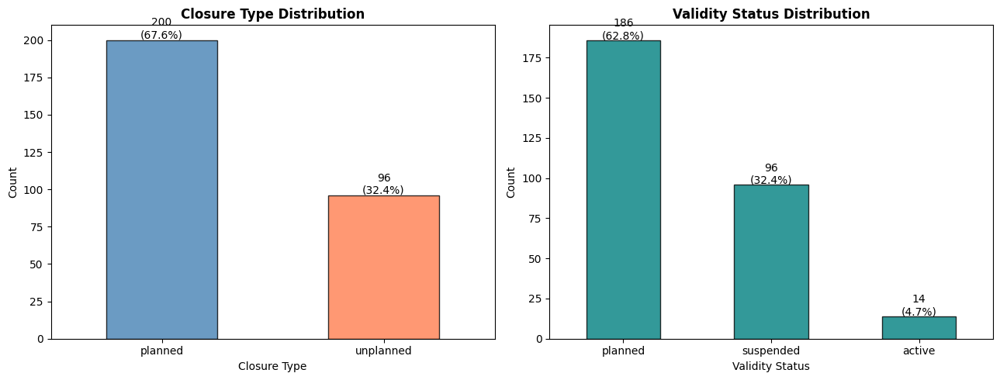

This structural pattern reflects how the DATEX II feed distinguishes incident-driven closures from scheduled roadworks.

**Cause type and source:** The dominant cause type is roadMaintenance accounting for 160 of 296 records. Unplanned closures are uniformly attributed to roadOrCarriagewayOrLaneManagement, sourced exclusively from Signs and Signals.

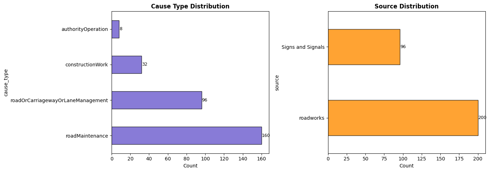

 This confirms that the two closure types are not only operationally distinct but are also sourced from different reporting systems within the DATEX II feed.
 

**Temporal distribution:** Closure start times cluster strongly between 18:00 and 21:00 UTC consistent with overnight planned maintenance windows on the SRN.

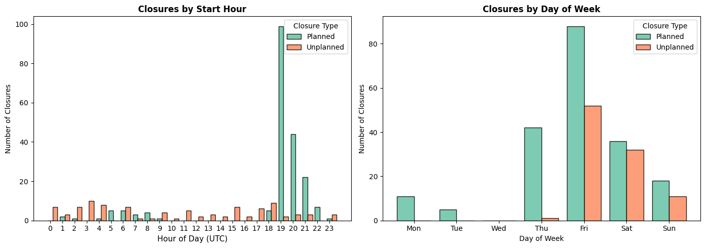

Unplanned closures show a flatter distribution across the day, as expected for incident-driven events. The number of concurrently active closures at any given hour across the observation window peaks at 110 - 115 closures around 00:00 - 12:00 UTC.

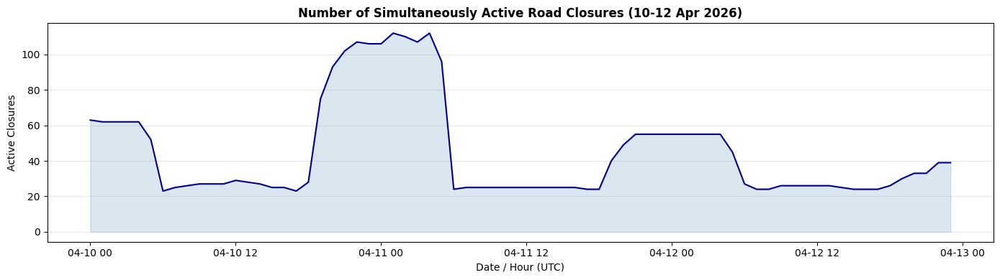

**Duration:** Closure duration ranges from 0.25 to 17,544 hours, with a median of 9 hours and a mean considerably higher due to a small number of long-running planned closures extending  730+ days. Planned closures tend to follow overnight windows of approximately 8-12 hours, while unplanned closures are shorter and more variable.

**Spatial distribution:** Closures span latitudes from  50.2359° to 55.0664°, with geographic concentration along -5.2584° to 1.7230° e.g. motorway and major A-road corridors in England. The roads most frequently appearing in the dataset are:

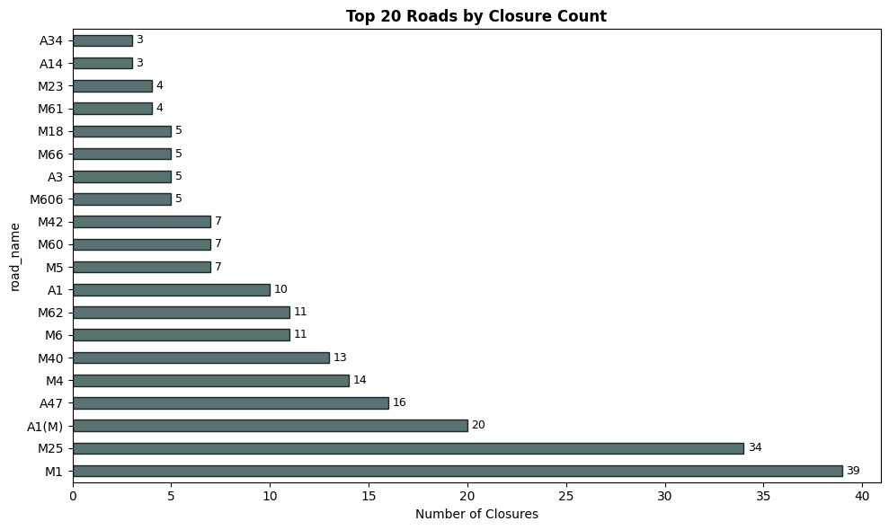

No closures are missing spatial coordinates, confirming all records are eligible for the haversine station-matching step.

**Lanes closed:** The lanes closed field ranges from 0 to4, with a median of 1. A total of 107 records carry zero lanes closed, indicating full-road or carriageway-level closures rather than partial lane restrictions. This field will serve as a proxy for disruption severity in the feature set.

---

> **Key findings - 3b: Road closures**
> - 296 closure records over 72 hours, 200 planned and 96 unplanned
> - 0% missing on all critical fields - dataset is complete and ready for spatial join without cleaning
> - Planned and unplanned closures are structurally distinct in both cause type and validity status
> - Planned closures concentrate in overnight windows; unplanned closures are distributed across the day
> - Median duration: 9 hours, distribution is right-skewed by a small number of long-running works
> - Spatial coverage: 50.24°-55.07°N and -5.26°- 1.72°E with no missing coordinates

---

## Section 4: Exploratory Data Analysis - Train Movements (EDA 03 + EDA 04)

This section examines the two rail-side data sources independently before any join with road closures. EDA 03 covers the Network Rail TRUST train moments feed - real-time observations of trains at locations with actual timestamps. EDA 04 covers the Darwin timetable - the planned service schedule for the same period. Together they form the two sides of the delay calculation: what was scheduled versus what was observed.

### 4.1 Train Moments (EDA 03)

Train moment files for the observation window were retrieved from the <code>train-moments</code> Azure Blob container via <code>data_loader.load_train_moment_files()</code>, covering 360 files. After parsing via <code>parse_train_moments()</code> and mapping STANOX codes to station TLC codes using the stations reference, the raw dataset contains 41026 rows across 32 columns.

**Completeness:** The two most operationally critical fields are <code>actual_timestamp</code> and <code>planned_timestamp</code>, as their difference forms the delay target variable. <code>actual_timestamp</code> is missing in 1,935 rows (4.7%); <code>planned_timestamp</code> in 2,377 rows (5.8%). Both timestamps are simultaneously missing in 1,935 rows, which are dropped prior to analysis. The cleaned dataset retains 39,091 rows. Other notable missing rates: <code>platform</code> (38.92%), <code>gbtt_timestamp</code> (36.47%) and <code>station_code</code> (27.42%), the latter reflecting STANOX codes that do not resolve to a known station TLC via the CORPUS crosswalk.

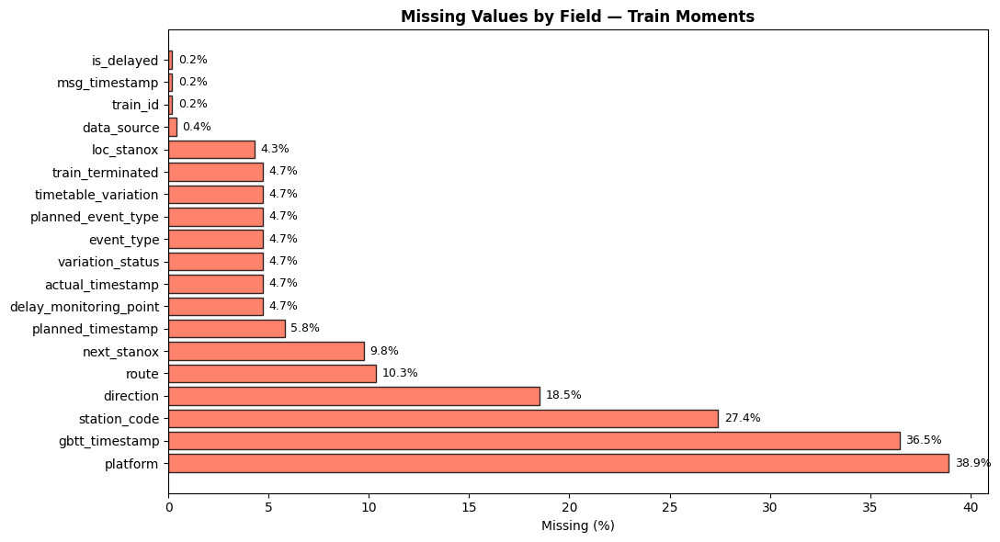

**Event type and variation status:** Train moments record two event types: DEPARTURE (23,552 records, 57.4%) and ARRIVAL (15,539 records, 37.9%). Variation status breaks down as: LATE (15,638), ON TIME (13,180), EARLY (9,831) and OFF ROUTE (442). The binary <code>is_delayed</code> flag, derived from variation status at ingestion, marks 38.1% of all cleaned records as delayed.

**Raw delay distribution:** The <code>timetable_variation</code> field records delay magnitude in minutes as reported by the feed, independent of road closure conditioning. The distribution is strongly right-skewed: median 1 minutes, mean 2.53 minutes, with the 95th percentile at 10 minutes and a maximum of 293 minutes. The skewness and kurtosis values (12.31 and 255.7 respectively) confirm a heavy-tailed distribution typical of rail delay data, where the vast majority of services run close to schedule but a small number of severe delays pull the mean considerably above the median.

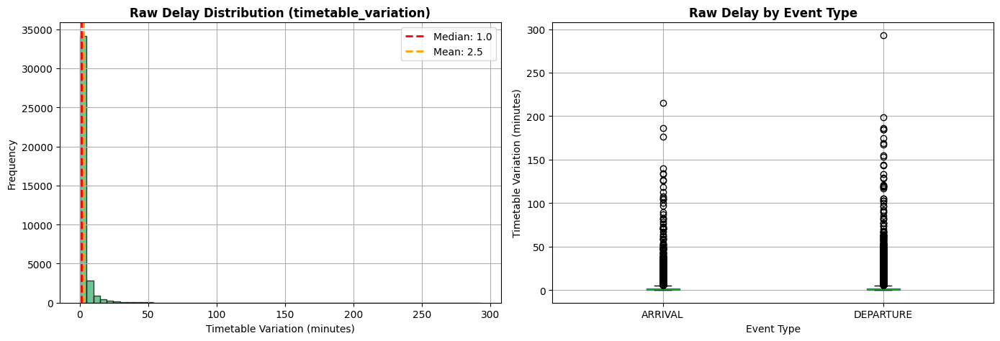

**Temporal distribution:** Train movements are concentrated between 10:00–14:00 and 19:00–22:00, consistent with morning and evening commute patterns. The day‑level breakdown shows substantial variation across the observation window: 2026‑04‑10 carries the highest volume with 23,562 movements, followed by 2026‑04‑12 with 10,658 and 2026‑04‑11 with 4,804. Night-hour movements are present but sparse.

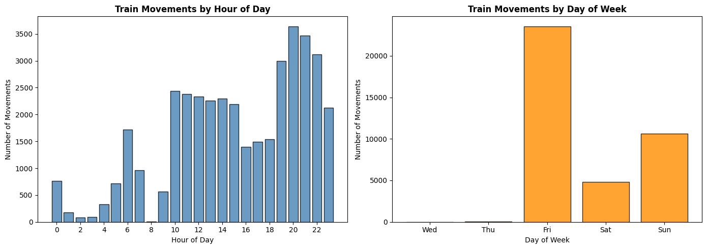

**Station code coverage:** Of 41,026 total train moment records, 29,778 (72.6%) successfully map to a station TLC code via the STANOX → 3ALPHA lookup. The remaining 11,248 (27.4%) records carry STANOX codes not present in the CORPUS extract, most likely representing junctions, sidings or non-passenger locations. These unmatched records are excluded from the spatial join but retained in the cleaned parquet for completeness.

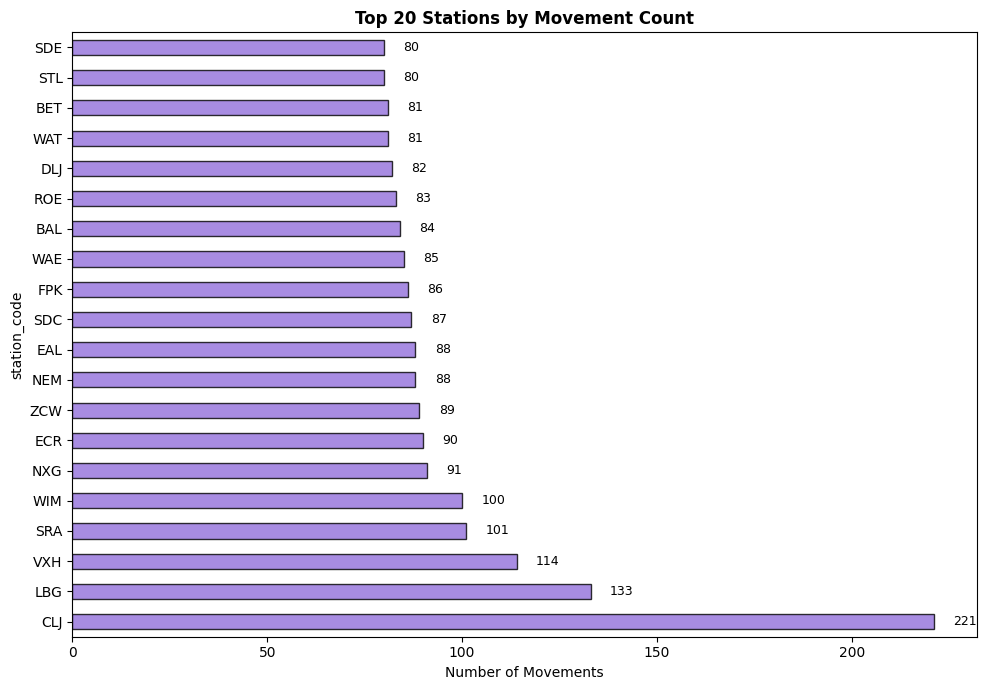

**Operational flags:** Three binary flags provide additional operational context. <code>delay_monitoring_point</code> is True for 45.9% of records, indicating official timing points used in punctuality measurement. <code>train_terminated</code> is True for 4.0% of records. The <code>data_source</code> field reveals that 88.4% of movements originate from SMART (the primary train describer feed), with the remainder from GPS, TSIA and other supplementary sources.

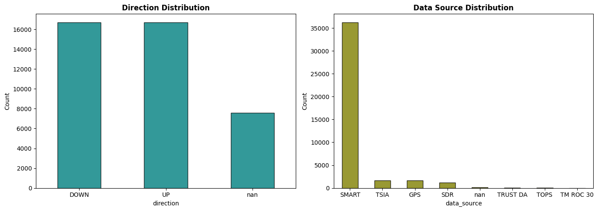

---

> **Key findings - 4.1: Train moments**
> - 41,026 raw rows, 39.091 retained after dropping records missing both timestamps
> - 38.1% of records classified as delayed (variation_status = LATE)
> - Raw delay distribution is heavily right-skewed: median 1 min, mean range from 2.53 to 293 mins
> - Station code match rate: 72.6%, unmatched records are non-passenger locations
> - SMART is the dominant data source (88.4% of records), GPS and TSIA supplement coverage
> - 45.9% of records flagged as official delay monitoring points

---

### 4.2 Darwin Timetable (EDA 04)

Darwin timetable XML files for the observation window were parsed from the <code>darwin-timetable-feeds</code> container via <code>data_loader.load_darwin_timetable()</code>, producing 121,733 journey records across 2 files. After flattening to one row per stop, the raw timetable dataset contains 1,898,719 rows across 14 columns, saved as <code>data/processed/darwin_timetable_clean.parquet</code>.

<b>Scale and structure:</b> The timetable is substantially larger than the train moments dataset, covering 121,121 unique journeys operated by 39 train operating companies. The largest TOCs by journey count are:

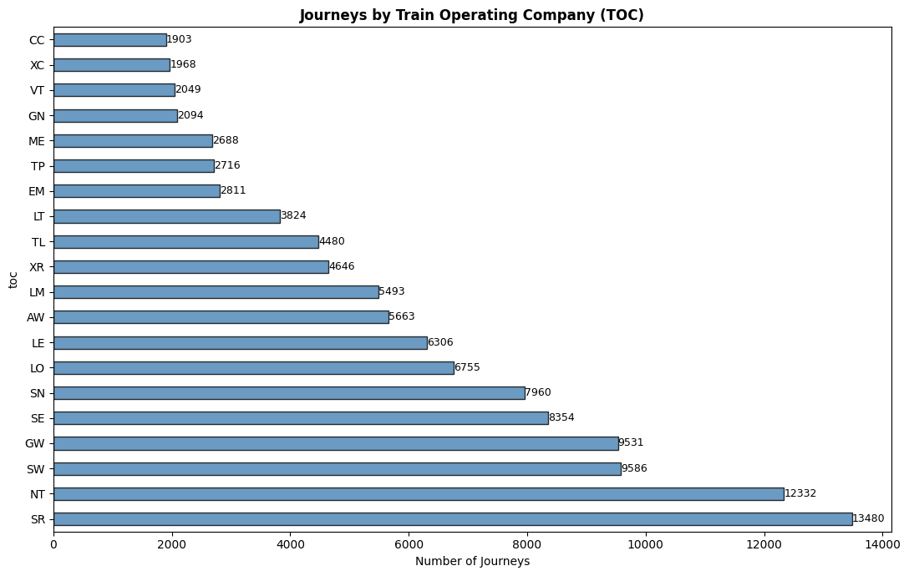

Stop types break down as: intermediate stops (<code>IP</code>, 45.6%), pass points (<code>PP</code>, 40%), destinations (<code>DT</code>, 5%) and origins (<code>OR</code>, 5%), with a small proportion of optional variants.

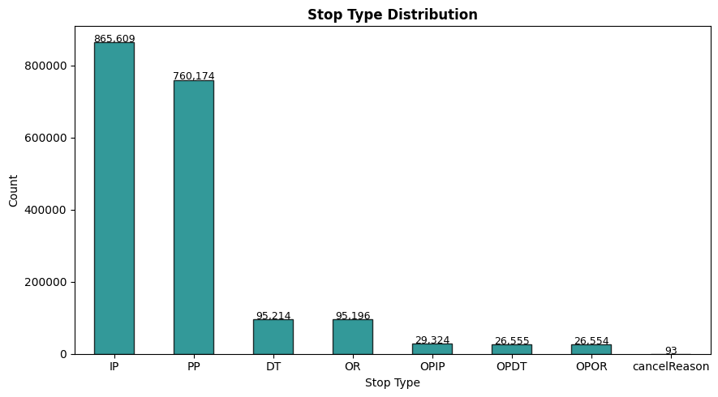

<b>Service date coverage:</b> Timetable records span 6 service dates within the observation window, with the largest single-day volume on 2026‑04‑10 (542,722 stop rows, 32,930 unique journeys). The coverage deliberately extends slightly beyond the road closure observation window to support forward prediction at window boundaries.

<b>Planned time field coverage:</b> The timetable distinguishes between working times (<code>wta</code>, <code>wtd</code>, <code>wtp</code>) used for operational planning and public times (<code>pta</code>, <code>ptd</code>) shown to passengers. Working time fields are present for 53.55% of records (<code>wta</code>) and 53.55% (<code>wtd</code>), pass-point working times (<code>wtp</code>) are present for 40%. Public times are present for approximately ≈ 50% of records. The high proportion of missing public times reflects pass-point stops, which have no public timetable entry. The <code>features.py</code> module applies a priority hierarchy to select the most appropriate time field per <code>act</code> codes, ensuring a planned timestamp is available for the maximum number of records.

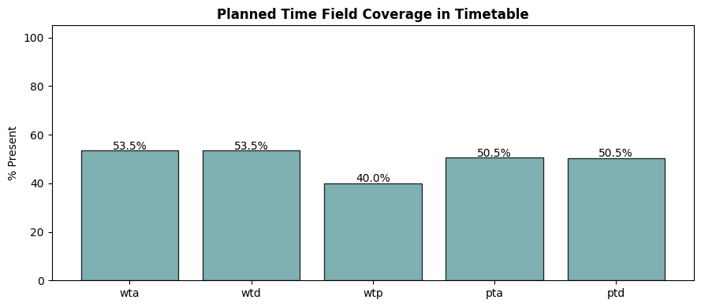

<b>Service frequency by hour:</b> Scheduled stops peak between 08:00 and 18:00, with the highest volumes around 16:00–18:00. This pattern is consistent with the train moments temporal distribution, providing reassurance that the timetable and movement feeds cover the same operational period.

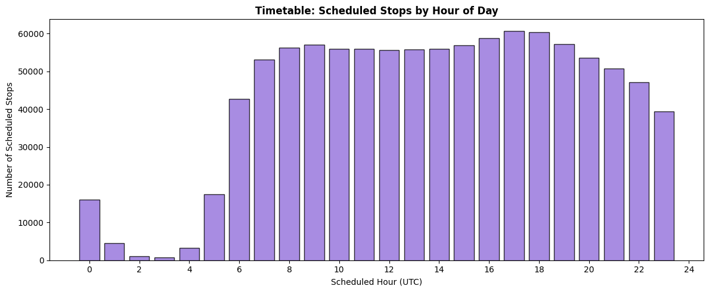

<b>Journey-level statistics:</b> The 121,121 unique journeys contain a median of 14 stops each, ranging from 2 to 150. The 33,737 journeys have five or fewer stops, representing short shuttle or freight services, while 55,029 journeys have more than fifteen stops, corresponding to long-distance intercity services.

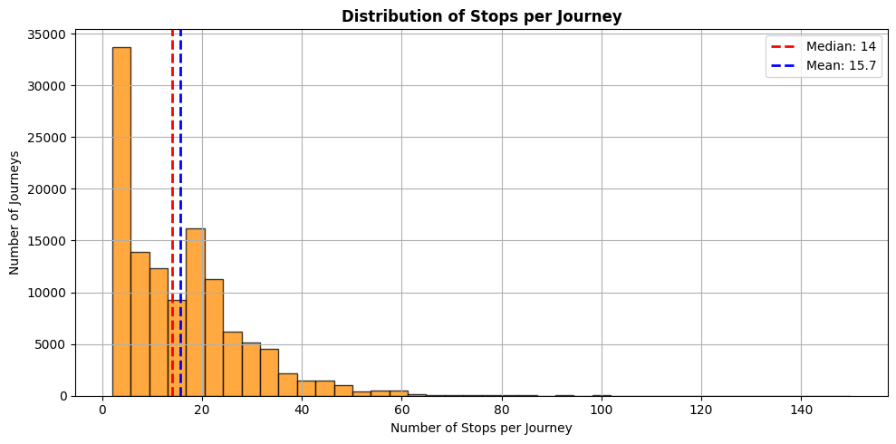

<b>TIPLOC match rate:</b> The timetable contains 5,003 unique TIPLOC codes. Matching these against the stations reference confirms that 2,583 (51.6%) resolve to a known station with coordinates. The remaining 2,420 TIPLOCs represent junctions, depots and non-station locations that carry no lat/lon and are therefore ineligible for the spatial join. At the row level, 1,166,537 of stop rows carry a matched TIPLOC, meaning 61.4% of the timetable is eligible to participate in the haversine join.

---

> <b>Key findings - 4.2: Darwin timetable</b>  
> - 1,898,719 stop rows across 121,121 unique journeys and 39 TOCs  
> - Working time fields (<code>wta</code>/<code>wtd</code>) present for ≈53.5% of records; <code>wtp</code> for ≈40%  
> - 5,003 unique TIPLOCs; 51.6% match to station coordinates, remainder are non-passenger locations  
> - At row level, 61.4% of timetable stops are spatially eligible for the haversine join  
> - Service frequency peaks between 08:00–18:00 hours, pattern consistent with train moments temporal distribution  
> - Median journey length: 14 stops, range from 2 to 150

---

## Section 5: Merged Analytical Dataset (EDA 05 + EDA 06)

This section documents the construction and analysis of the two merged datasets that form the foundation of the modelling pipeline. EDA 05 covers the road closure and train moments join - the retrospective dataset where both planned and actual timestamps are known and delay can be calculated directly. EDA 06 covers the road closure and Darwin timetable join - the forward-looking prediction dataset where only planned timestamps are available and the model must generate delay forecasts before outcomes are observed.

### 5.1 Spatial Join - Closure to Station Matching

Both datasets are constructed using the same spatial join logic implemented in <code>geo.find_nearby_stations()</code>. For each road closure, a vectorised haversine distance is computed between the closure centroid and every station in the reference dataset. Stations falling within a 10-25 km band are retained as candidate impact locations, producing one row per closure-station pair. The lower bound of 10 km excludes stations immediately adjacent to the closure, where the causal mechanism is direct physical obstruction rather than modal shift and the upper bound of 25 km reflects the project's hypothesis that cross-modal effects attenuate beyond this range.

Applied to the 296 road closures in the cleaned dataset, the spatial join produces 16,361 closure-station pairs across 2,594 unique stations. The mean distance between a closure and its matched stations is 19 km, with distances uniformly distributed across the 10-25 km band by design.

### 5.2 Temporal Filter

Following the spatial join, a 60-minute temporal filter (<code>features.filter_within_time_window()</code>) retains only those station service events whose planned timestamp falls within the 0-60 minute window after the closure start time. This window reflects the project's core hypothesis: that road-to-rail modal shift effects manifest within one hour of a closure opening. Events outside this window either preceding the closure or more than 60 minutes after it are excluded from both datasets.

The filter is applied uniformly across all 10-minute sub-buckets within the window. Distribution of records across sub-buckets is approximately uniform in both datasets (approximately 16 - 18 % per 10-minute bucket), confirming that the temporal filter does not introduce a systematic bias toward any particular phase of the closure window.

### 5.3 Road Closures + Train Moments Dataset (EDA 05)

The retrospective analytical dataset is produced by merging the spatially expanded road closure table with the cleaned train moments dataset on station code and date, then applying the 60-minute temporal filter.

<b>Dataset shape:</b> After the spatial join (16,361 closure-station pairs), station-level merge and temporal filter, the final analytical dataset contains 5,446 rows representing 126 unique closure events across 854 unique stations. This is the dataset the model trains on.

<b>Target variable - delay:</b> Delay is computed as (<code>actual_timestamp − planned_timestamp</code>) in minutes. The distribution is centred close to zero (median 0 minutes, mean 1 minutes) but exhibits considerable spread (standard deviation 5.66 minutes) and heavy tails in both directions. Extreme early arrivals (below 30 minutes) account for 0.26 % of records, extreme late arrivals (above 30 minutes) account for 0.22 %. The most delayed individual record in the dataset shows a delay of 52.5minutes at Shortlands station, associated with a planned closure.

The distribution's negative skewness (-2.9236) and high kurtosis (85.8512) reflect a pattern common in rail delay data: most services run close to schedule or slightly early, with a long right tail of significant delays. This motivates framing the prediction task as classification (delayed vs not delayed) rather than regression, as the continuous delay value is dominated by noise at low magnitudes.

<b>Predictor distributions:</b> The two primary continuous predictors are <code>distance_in_km</code> (haversine distance from closure to station, range 10-25 km by construction) and <code>planned_time_diff</code> (minutes elapsed since closure start, range 0-60 by construction). Both are approximately uniformly distributed within their bounds. A derived interaction term <code>distance_time_interaction</code> (distance × time) is also available for modelling.

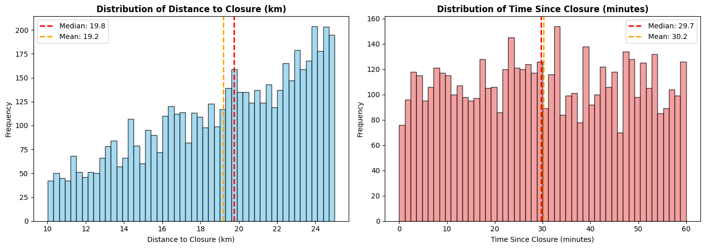

<b>Delay by categorical variables:</b> Mean delay differs between closure types: planned closures are associated with a mean delay of 1.59 minutes versus  0.52 minutes for unplanned closures. This is not causally interpretable  planned closures occur predominantly overnight when rail service frequency is lower, confounding the comparison. 
Delay is broadly similar across event types (ARRIVAL: mean 0.97 min , DEPARTURE: mean 1.03 min).

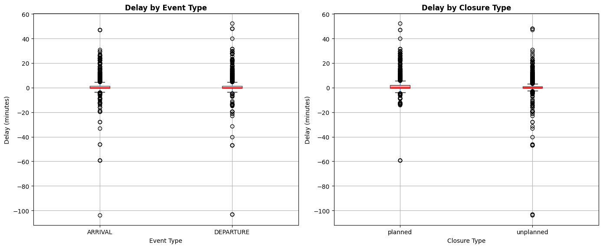

<b>Bivariate relationships:</b> Pearson correlation between <code>distance_in_km</code> and delay is –0.020 and between <code>planned_time_diff</code> and delay is 0.019, both close to zero. This weak linear signal is consistent with the expectation that road-to-rail disruption effects are mediated by complex routing and modal shift behaviour rather than a simple linear distance-decay function. The mean delay heatmap across distance × time bins shows no discernible spatial pattern.

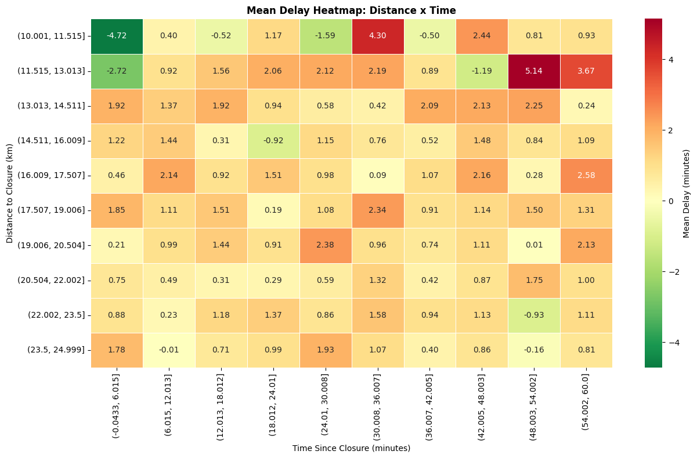

<b>Temporal patterns:</b> Mean delay by hour of day shows 
- Negative delays in early morning hours
- Positive delays around midday and early afternoon. 

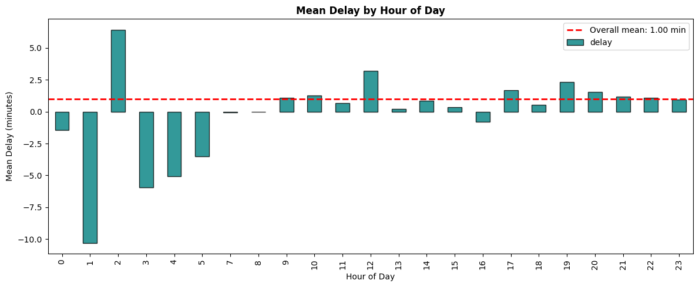

This temporal signal may partially reflect underlying rail congestion patterns rather than road closure effects and is noted as a potential confound in the modelling phase.

<b>Spatial patterns:</b> The 854 stations represented in the dataset contribute unequally: the top 15 stations by record count account for 13.2% of all rows. The most frequently appearing stations are located near high-closure-density road corridors.

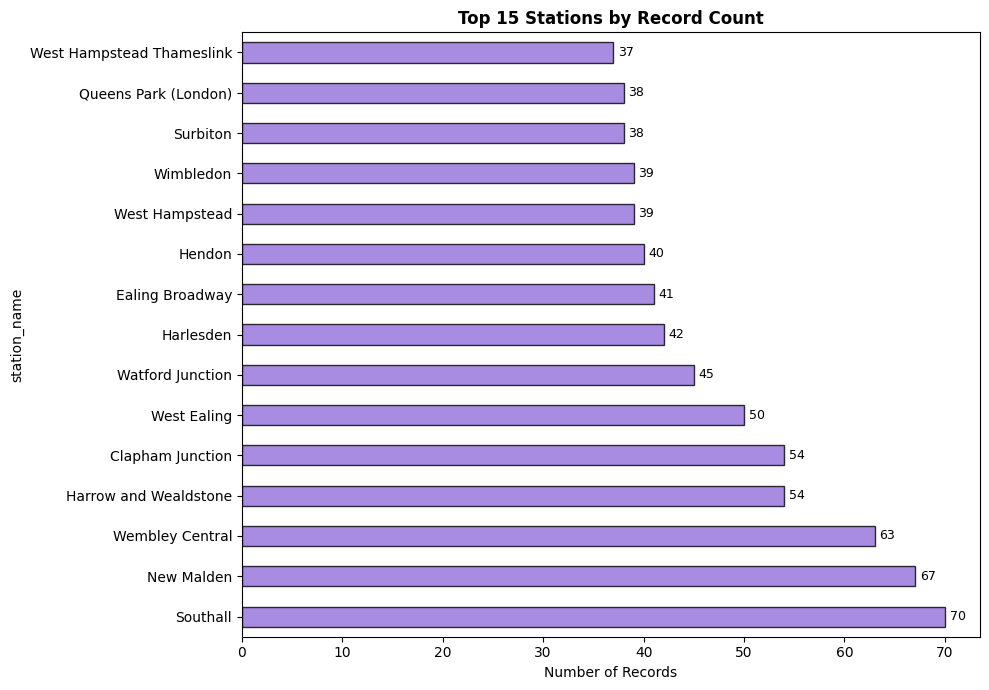

Individual closure impact varies widely: the median closure affects 13.5 station-service pairs within the window, while the highest-impact closure affects 334 pairs.

---

> <b>Key findings - 5.1: Road + train moments dataset</b>  
> - 5,446 rows after spatial join and 60-minute temporal filter, 126 closures, 854 stations  
> - Delay distribution: median 0 min, mean 1 min, std 5.66 min - right-skewed with heavy tails  
> - Weak linear correlation between spatial/temporal predictors and delay, non-linear modelling approach warranted  
> - Planned closures associated with marginally higher mean delay than unplanned, confounded by time-of-day  
> - Uniform distribution across 10-minute time buckets confirms no temporal filter bias  
> - 26 extreme delay records (14 early, 12 late) retained but flagged for sensitivity analysis  

---

### 5.4 Road Closures + Timetable Dataset (EDA 06)

The forward-looking prediction dataset mirrors the retrospective pipeline but substitutes the Darwin timetable for train moments. Because the timetable contains only planned timestamps - no actual observations - there is no delay column in this dataset. Its purpose is to identify which scheduled services fall within the spatial and temporal impact zone of each closure, so the trained model can generate delay forecasts for services not yet operated.

<b>Dataset shape:</b> After the spatial join, schedule merge on station and service date and 60-minute temporal filter, the timetable dataset contains 100,069  rows representing 190 unique closures across 1,467 unique stations. This is substantially larger than the retrospective dataset, reflecting the much greater volume of the timetable relative to the train moments sample.

<b>Coverage comparison:</b> Comparing the two datasets reveals an important asymmetry. The timetable dataset is approximately 18.4× larger than the train moments dataset after identical filtering. Station overlap between the two datasets is  846 stations in common, with 621 stations appearing only in the timetable dataset and 8 appearing only in the train moments dataset. All closures represented in the train moments dataset are also present in the timetable dataset, but 64 additional closures appear only in the timetabl, these are events for which no train moment records were captured during the observation window, likely due to sparse service frequency at affected stations.

This asymmetry has a direct implication for the modelling strategy: the model is trained on 5,446 labelled rows from the retrospective dataset but generates predictions for 100,069 rows in the forward-looking dataset. The prediction set is substantially larger and covers a wider set of stations and closures than the training set, which represents a meaningful generalisation challenge.

<b>Predictor distributions:</b> As in the retrospective dataset, <code>distance_in_km</code> and <code>planned_time_diff</code> are approximately uniformly distributed by construction. The interaction term and categorical features (closure type, cause type, event type, validity status) carry the same distributions as the retrospective dataset, confirming the two datasets are structurally compatible for prediction.

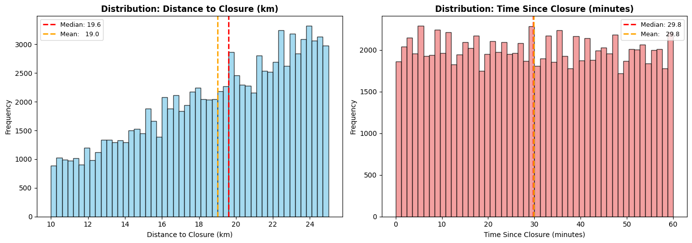

<b>Event type composition:</b> The timetable dataset contains a higher proportion of ARRIVAL and PASS events relative to DEPARTURE events compared to the retrospective dataset. This reflects the fact that pass-point stops (<code>PP</code>) appear in the timetable but generate no train moment records, as they are not reporting points in the TRUST feed.

<b>Closure type x Event type:</b>

| closure / event | ARRIVAL| DEPARTURE | PASS | Total |
|-----------------|--------|-----------|------|-------|
| planned         | 200    |2961       | 6604 | 43223 |
| unplanned       | 41939  |3524       | 11383| 56846 |
| Total           | 75597  |6485       | 17987| 100069|

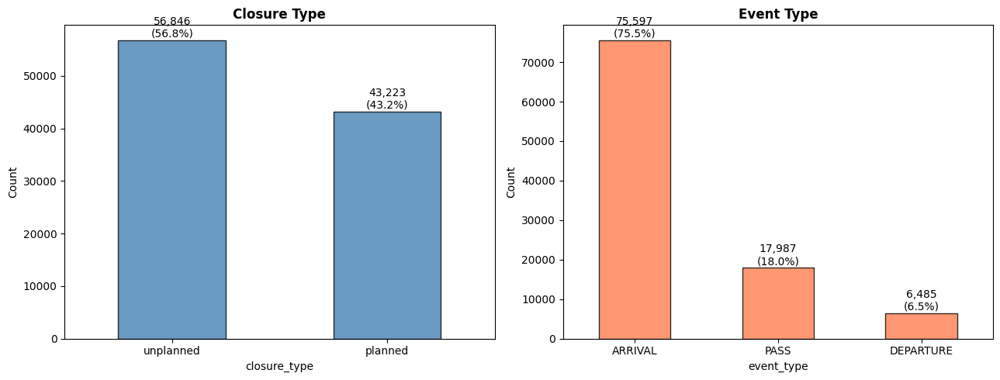

<b>Scheduled service density by hour:</b> Scheduled services within the closure window peak  between 18:00 and 22:00, with the largest concentration of records at 21:00. This hour-level density is driven by the interaction of closure timing (predominantly overnight for planned, daytime for unplanned) and rail service frequency and confirms that the temporal filter captures a representative cross-section of scheduled operations.

<b>Closure impact on timetable:</b> Individual closure impact on timetable services varies widely: the median closure affects 186.5 scheduled services within the 60-minute window, while the highest-impact closure affects 4,486 services. This range reflects differences in both the geographic density of rail services near the closure and the duration of the closure relative to the observation window.

---

> <b>Key findings - 5.2: Road + timetable dataset</b>  
> - 100,069 rows after spatial join and temporal filter, 190 closures, 1,467 stations  
> - Timetable dataset is  ≈18.4× larger than retrospective dataset after identical filtering  
> - 621 stations and 64 closures present only in timetable - model must generalise beyond training distribution  
> - No delay column, this is the predictiononly dataset, model outputs are delay probability forecasts  
> - Pass-point stops inflate timetable row count relative to train moments, event type composition differs  
> - Median closure impact: 186.5 scheduled services; max: 4,486  

---

# Section 6: Modelling & Prediction Pipeline - Outline

---

## 6.1 Problem Framing

<ul align="justify">
  <li>Why classification rather than regression
  <li>Delay distribution is heavily right-skewed with median = 0, predicting exact minutes is dominated by noise at low magnitudes</li>
  <li>Motivates F1 / ROC-AUC as primary evaluation metrics rather than RMSE</li>
  </li>
</ul>

---

## 6.2 Feature Engineering

Features drawn from the merged retrospective dataset (EDA 05). Grouped by type:

<ul align="justify">
  <li><b>Spatial</b>
    <ul>
      <li><code>distance_in_km</code> - haversine distance from closure centroid to station (10–25 km by construction)</li>
      <li><code>distance_time_interaction</code> - distance × planned_time_diff (derived interaction term)</li>
    </ul>
  </li>
</ul>

<ul align="justify">
  <li><b>Temporal</b>
    <ul>
      <li><code>planned_time_diff</code> - minutes elapsed between closure start and scheduled service (0–60 by construction)</li>
      <li><code>start_hour</code> - hour of day of closure start (captures overnight vs daytime maintenance patterns)</li>
      <li><code>start_dow</code> - day of week of closure start (weekday vs weekend service frequency differs)</li>
    </ul>
  </li>

  <li><b>Closure metadata</b>
    <ul>
      <li><code>closure_type</code> - planned / unplanned (binary, one-hot encoded)</li>
      <li><code>cause_type</code> - roadMaintenance, accident, etc. (categorical, one-hot encoded)</li>
      <li><code>validity_status</code> - active / suspended / planned (categorical, one-hot encoded)</li>
    </ul>
  </li>

  <li><b>Rail service metadata</b>
    <ul>
      <li><code>event_type</code> - ARRIVAL / DEPARTURE / PASS (categorical, one-hot encoded)</li>
    </ul>
  </li>

  <li><b>Not included and why</b>
    <ul>
      <li><code>poslist</code> / raw geometry - too high-dimensional for this proof-of-concept scope</li>
      <li><code>road_name</code> - high cardinality; would require embedding or hashing not justified at this stage</li>
      <li>Footfall - available per station but not time-varying within the window, low marginal value</li>
    </ul>
  </li>
</ul>

---

## 6.3 Model Selection

Three candidate models evaluated:

| Model | Rationale |
|---|---|
| Logistic Regression | Interpretable baseline, establishes whether linear decision boundary is sufficient |
| Random Forest | Handles non-linear relationships and feature interactions; robust to class imbalance with class_weight='balanced' |
| XGBoost | Gradient boosting; strongest expected performance on tabular data; native handling of missing values |

All three trained on the same feature set to enable direct comparison. Final model selected on validation F1 score.

---

## 6.4 Train / Test Split Strategy

<ul align="justify">
  <li>Temporal split preferred over random split, avoids data leakage across time</li>
  <li>Train-Test split - 80/20 strategy</li>
  <li>Class imbalance handled via <code>class_weight='balanced'</code> (sklearn) or <code>scale_pos_weight</code> (XGBoost)</li>
  <li>No cross-validation given the small dataset size (5,446 rows), single temporal hold-out reported</li>
</ul>

---

## 6.5 Evaluation Metrics

<ul align="justify">
  <li><b>Primary metrics:</b>
    <ul>
      <li>Evaluation Metrics - MAE, RMSE, R2, MAPE will be evaluated on all models</li>
      <li>ROC-AUC - threshold-independent measure of discriminative ability</li>
      <li>F1 score - harmonic mean of precision and recall, appropriate given class imbalance</li>
      <li>Precision / Recall - reported separately to characterise the cost of false positives vs false negatives in an operational context</li>
    </ul>
  </li>

  <li><b>Secondary:</b>
    <ul>
      <li>Confusion matrix</li>
      <li>Calibration plot - important for a probabilistic output used in an operational dashboard</li>
    </ul>
  </li>
</ul>

---

## 6.6 Explainability

<ul align="justify">
  <li>Feature importance (MDI) from Random Forest and XGBoost - which variables drive predictions most</li>
  <li>SHAP summary plot if implemented - directional effect of each feature on predicted delay probability</li>
  <li>Explainability is a stated requirement of the Kainos brief ("intentionally lightweight, explainable") - findings reported here directly address that objective</li>
</ul>

---

## 6.7 Forward Prediction on Timetable Dataset

<ul align="justify">
  <li>Trained model applied to the 100,069-row timetable dataset (EDA 06)</li>
  <li>Output: delay probability score per scheduled service within the 60-minute closure window</li>
  <li>Services ranked by predicted probability - highest-risk services surfaced first</li>
  <li>Generalisation challenge noted: 621 stations and 64 closures in prediction set not seen during training</li>
</ul>

---

## 6.8 Limitations of the Modelling Approach

<ul align="justify">
  <li>Small training set (5,446 rows) limits model complexity and confidence in generalisation</li>
  <li>72-hour observation window may not capture seasonal or weekday/weekend variation</li>
  <li>Causal inference not established - the model identifies correlation between closure proximity and delay, not a verified mechanism</li>
</ul>

# Section 7: Critical Evaluation & Conclusions - Outline

---

## 7.1 Limitations

<b>Data and scope</b>

<ul>
<li>72-hour observation window (10–12 April 2026) - single weekend window; no weekday, seasonal or regional variation captured</li>
<li>Train moments dataset small post-filter (5,446 rows) - limits statistical power and generalisation confidence</li>
<li>TIPLOC match rate in timetable: ~61.4% at unique code level, non-passenger locations (junctions, depots) cannot be spatially joined introduces coverage gap for some routes</li>
<li>STANOX → TLC crosswalk via CORPUS: 1 unmatched station out of 2,595, negligible but noted</li>
<li>Street Manager data collected but outside analytical window, emergency works not included in this proof-of-concept</li>
<li>BODS (bus) data not integrated</li>
</ul>

<b>Methodological</b>

<ul>
<li>Causal mechanism not established - model identifies spatial-temporal correlation between closures and delays, not a verified road-to-rail displacement pathway</li>
<li>Binary delay target loses severity information - a 1-minute delay and a 30-minute delay are treated identically</li>
<li>Temporal split with a 72-hour window provides a thin test set - generalisation estimates are indicative, not robust</li>
<li>Haversine distance uses closure centroid, not full road geometry - long closures with complex polyline geometries may be misrepresented by a single centroid point</li>
</ul>

---

## 7.2 Answers to Research Questions

<b>RQ1: Do SRN/MRN closures measurably affect rail punctuality within 10–25 km?</b>

<ul>
<li>Empirical finding from EDA 05: mean delay of 1 min, median 0 min across 5,446 closure-adjacent service events</li>
<li>Pearson correlation between distance/time proximity and delay: r ≈ 0.02 - weak linear signal</li>
<li>modeling result - does the classifier perform above baseline? Does feature importance confirm any spatial or temporal signal?</li>
<li>Honest assessment: the EDA alone does not confirm a strong causal signal; the model result will determine whether any predictive relationship exists</li>
</ul>

<b>RQ2: Can road event metadata forecast rail delay within a 60-minute horizon?</b>

<ul>
<li>Evaluation metrics from best model</li>
<li> which features carry most importance</li>
<li>Binary framing pragmatic given distribution, future work should explore severity prediction</li>
</ul>

<b>RQ3: What pipeline architecture supports real-time integration into a Transport Data Platform?</b>

<ul>
<li>Answered architecturally in Section 2: Kafka ingestion, Azure Blob Storage, Python src/ library, parquet intermediate outputs</li>
<li>Forward prediction on 100,069 timetable rows demonstrated feasibility of scoring services before outcomes observed</li>
<li>Latency of the current pipeline:  e.g. batch upload cadence, time from closure event to scored output</li>
</ul>

---

## 7.3 Commercial Applicability

<ul>
<li>The pipeline architecture (Kafka → Azure Blob → Python processing → scored output) is directly compatible with Kainos's Transport Data Platform patterns</li>
<li>Scoring the timetable dataset produces a ranked list of at-risk services per closure event - actionable output for control room use without requiring domain expertise to interpret</li>
<li>Explainable model (feature importance / SHAP) meets the stated requirement for interpretability in operational tools</li>
<li>Street Manager integration (emergency works with minimal lead time) is the highest-priority near-term extension - data already collected, pipeline already exists</li>
<li>A production version would require: longer training window, live Kafka scoring (rather than batch) and integration with a dashboard or alerting layer</li>
</ul>

---

## 7.4 Future Work

<ul>
<li><b>Longer observation window</b> - 4–12 weeks of data would substantially improve model robustness and allow weekday vs weekend stratification</li>
<li><b>Street Manager integration</b> - emergency works data already ingested; including it would extend coverage to unplanned short-notice closures not captured in DATEX II</li>
<li><b>Tri-modal extension (BODS)</b> - bus SIRI VM feeds would enable road–rail–bus disruption modelling; highest value in urban corridors with dense bus networks</li>
<li><b>Regression / severity modelling</b> - once training data volume is sufficient, predicting delay magnitude would produce richer operational outputs</li>
<li><b>Equity analysis</b> - GeoDS accessibility and smartcard data (identified as desirable in the Kainos brief) would enable assessment of which passenger groups are disproportionately affected by cross-modal disruption</li>
<li><b>Live scoring pipeline</b> - replace batch Azure Blob processing with a real-time Kafka consumer scoring services as closure events arrive</li>
</ul>

---

## 7.5 Ethical Considerations

<ul>
<li>All data sources are open or licensed under publicly accessible terms (Rail Data Marketplace, National Highways open data); no personally identifiable information is processed at any stage</li>
<li>The CORPUS, GB Stations and Darwin timetable datasets are used in accordance with their respective licence terms</li>
<li>Model outputs are probabilistic scores, not deterministic labels - appropriate for operational support rather than automated decision-making</li>
<li>Transparency: the model is intentionally lightweight and explainable, consistent with responsible AI principles for public sector deployment</li>
</ul>

---

## 7.6 Conclusion

This project demonstrates that a lightweight, open-data pipeline can integrate road and rail data sources at national scale, construct a spatially and temporally filtered analytical dataset and produce a proof-of-concept delay prediction model within a single MSc project scope. The EDA establishes a clear data foundation: 5,446 labelled training rows, 100,069 forward-prediction rows and a reusable pipeline capable of reproducing both datasets for any future time window. While the short observation window and small training set limit the strength of conclusions that can be drawn, the pipeline architecture, feature set and modelling framework are directly extensible to a production-grade Transport Data Platform - which is the outcome of most direct commercial value.

---