# Road-Rail Resilience: Technical Report

## 1. Introduction

This project examines whether unplanned road closures on the Strategic Road Network and Major Road Network can help predict rail performance degradation at nearby stations. The starting point is a practical operational problem. Road and rail systems are experienced by passengers as connected networks, but the data used to manage them is usually held in separate systems. National Highways records road closures through DATEX II feeds, while Network Rail and the Rail Delivery Group publish rail movement and timetable data through TRUST and Darwin. These sources are valuable individually, but they do not naturally support cross-modal analysis.

The aim of this project is to build a proof-of-concept machine learning model that predicts whether a rail station will experience degraded performance on a given day when road closures occur within a 10 to 25 kilometre radius. A station-day is defined as disrupted when mean arrival delay is greater than five minutes. The work is not designed to prove causality. The available data cannot show that road closures directly cause rail delays. Instead, the project tests whether road closure features contain enough predictive signal to support an early warning tool.

## 2. Data and Infrastructure

The project integrates five datasets. DATEX II road closure data provides the external disruption signal. TRUST train movement data provides the rail performance outcome. Darwin timetable data supports forward prediction because it contains planned services that have not yet operated. GB Stations provides station coordinates. CORPUS links identifiers across rail datasets by mapping STANOX, TIPLOC and CRS codes.

The ingestion and modelling layers are separated. Google Colaboratory was used for ingestion because TRUST and DATEX II required ongoing data collection. Azure Blob Storage was used as the shared data layer. The modelling and dashboard work were completed in Python using Pandas, NumPy, scikit-learn, XGBoost, LightGBM, Folium, Matplotlib and Gradio.

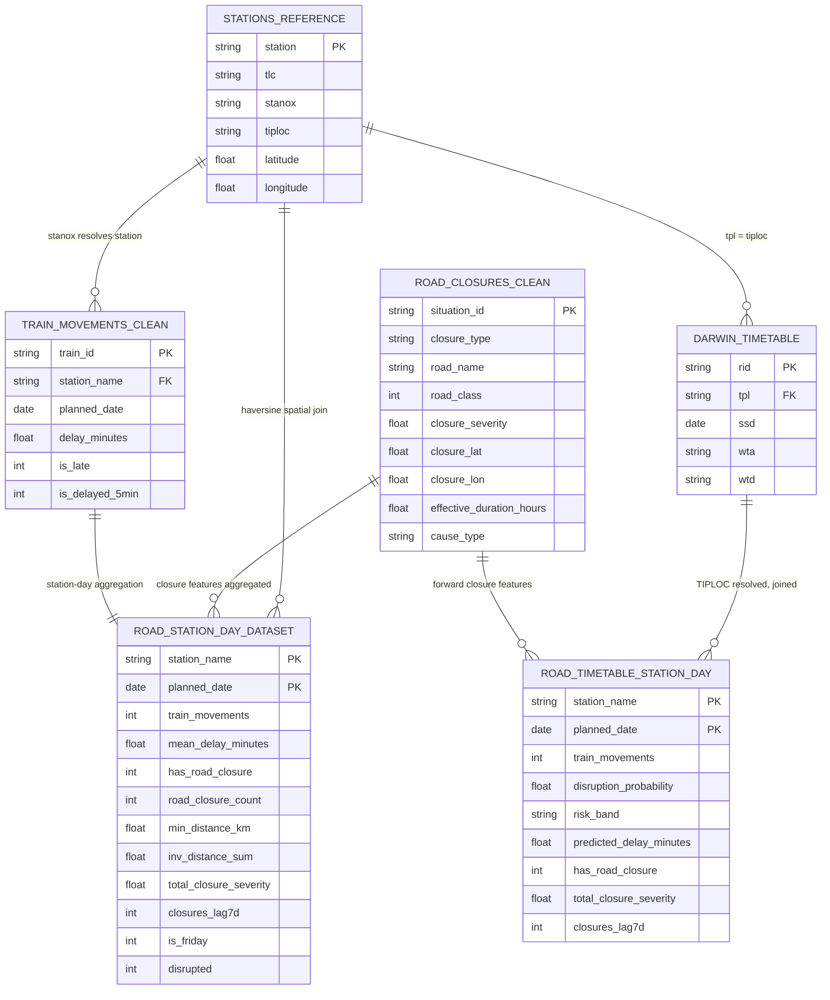

The repository is organised around three main areas:

| Area | Purpose |
|---|---|
| `notebooks/data_ingestion/` | Collects road, rail and timetable feeds |
| `notebooks/eda_*.ipynb` | Cleans, joins and analyses the datasets |
| `src/` | Supports the Gradio application, maps, charts and model outputs |

The dashboard is launched through `app.py`. It loads the interface layout from `src/layout.py`, data and model artefacts from `src/data.py`, maps from `src/maps.py` and summary charts from `src/dashboard.py`.

## 3. Pipeline Design

The final pipeline works at station-day level. Earlier work considered train-level prediction, but this created too much sparsity and noise. A single road closure can affect many services differently and TRUST does not contain passenger loading or crowding information. Station-day aggregation gives a more stable representation of local rail performance.

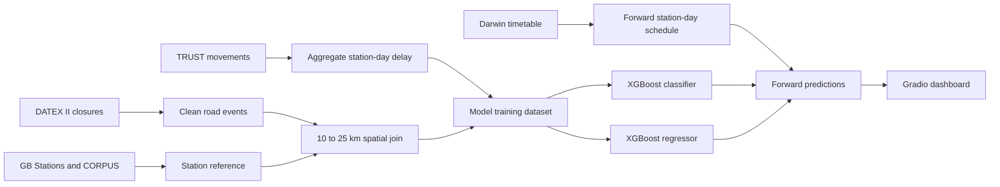

The spatial join uses haversine distance between each road closure centroid and each station coordinate. Only stations between 10 and 25 kilometres from a closure are retained. The lower bound reduces the risk of capturing direct infrastructure proximity effects. The upper bound reflects the assumption that passenger diversion becomes less plausible as distance increases.

Road closures are expanded across the dates on which they are active. Where more than one closure affects the same station-day, cumulative features are calculated. This allows the model to capture the combined effect of multiple nearby road events.

## 4. Feature Engineering

Features are organised into five groups.

| Group | Example Features |
|---|---|
| Closure attributes | Closure count, unplanned closure count, minimum distance and duration |
| Spatial severity | Road class severity and inverse-distance weighted closure score |
| Temporal memory | One-day, three-day and seven-day lag closure counts |
| Calendar effects | Day of week, Monday flag, Friday flag and weekend flag |
| Rail volume | Train movement count at station-day level |

The main target is binary. A station-day is labelled disrupted when mean arrival delay is greater than five minutes. This threshold gives the prediction a practical interpretation. It identifies station-days where performance degradation is large enough to matter operationally.

A complementary regression target estimates mean delay in minutes. This supports the dashboard by showing both disruption probability and expected delay magnitude.

## 5. Dataset Overview

The final integrated station-day dataset contains 33,941 rows from 3 April to 28 April 2026. It includes 2,506 stations, 1,368 cleaned road closures and 212,884 cleaned TRUST movement records. Of the station-days, 20,052 had at least one road closure active within the 10 to 25 kilometre radius. A smaller subset of 15,040 had at least one unplanned closure nearby.

The five-minute threshold produced 1,916 disrupted station-days and 32,025 non-disrupted station-days. This gives a disruption rate of 5.65% and a class imbalance ratio of 16.7:1. The imbalance shaped the evaluation approach. Accuracy was not used as the main metric because a model could achieve high accuracy by predicting no disruption for almost every row.

## 6. Exploratory Findings

The correlation analysis showed that the cross-modal signal is weak at station-day level. No feature had an absolute Pearson correlation above 0.09 with mean arrival delay. Road closure count, unplanned closure count, inverse-distance score and total closure severity all had correlations below 0.02.

Day-of-week effects were stronger than most road features. Friday had the highest mean delay and highest disruption rate. This suggests that background rail operating patterns explain more variation than road closure features within the current dataset.

  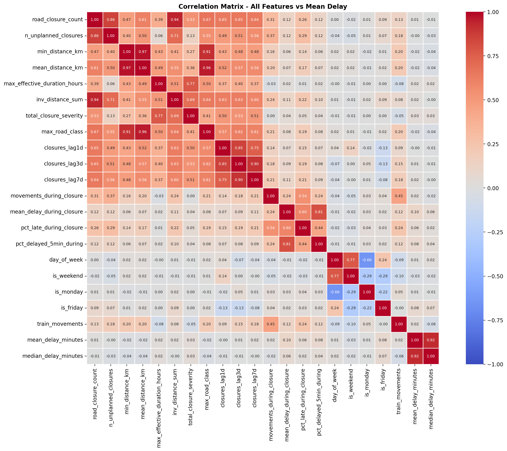

Closure-hour analysis provided a directional but not conclusive result. Station-days affected by unplanned closures showed slightly higher delays than station-days affected only by planned closures. This is operationally plausible because unplanned events give operators less time to respond. However, the subset is too small to support a strong claim.

## 7. Modelling Results

Six classification models were evaluated using a chronological train-test split. The main model was XGBoost, with Logistic Regression, Random Forest, Gradient Boosting, LightGBM and a dummy baseline used for comparison. Precision-Recall AUC was selected as the primary metric because disrupted station-days are rare.

  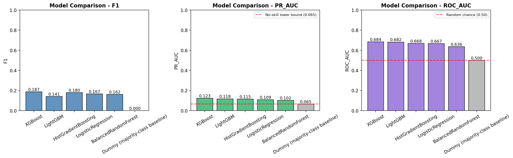

XGBoost achieved the highest PR-AUC at 0.120 against a random baseline of 0.065. This is an improvement over chance, but it remains weak for operational use. At the selected threshold of 0.53, the model recovered 49% of disrupted station-days but produced low precision. In practice, this means many false alerts would be generated.

  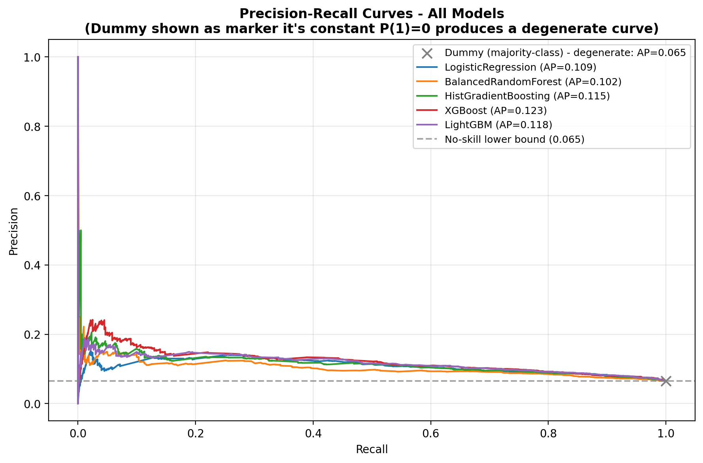

The most important classification features were maximum effective closure duration, train movement count, Friday indicator, total closure severity and seven-day closure lag. The binary feature showing whether any road closure existed had zero importance once severity and duration features were included. This is important because it shows that the model responds to closure magnitude rather than simple closure presence.

  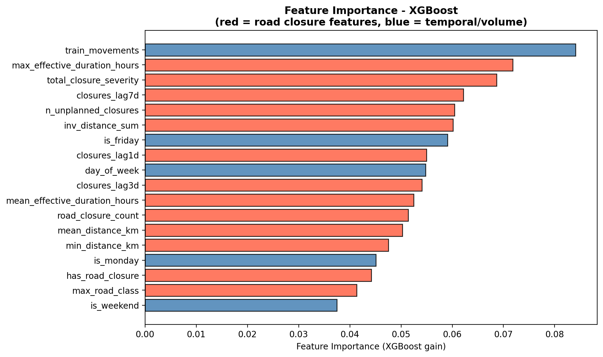

The regression model gave weaker results. Tuned XGBoost achieved an MAE of 1.552 minutes, only slightly better than the dummy mean baseline at 1.576 minutes. The R2 score was 0.010, meaning the model explained approximately 1% of delay variation. This confirms that delay magnitude remains difficult to predict with the available open data features.

  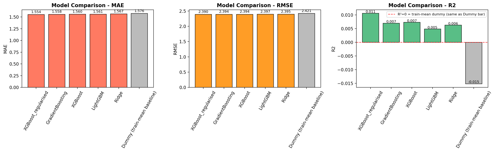

## 8. Dashboard Output

The Gradio dashboard provides an operational view of the pipeline. Users can filter closures by date, time, closure type, distance and duration. Selecting a closure shows nearby stations. Selecting a station shows predicted disruption probability, predicted delay, historical performance and timetable prediction charts.

  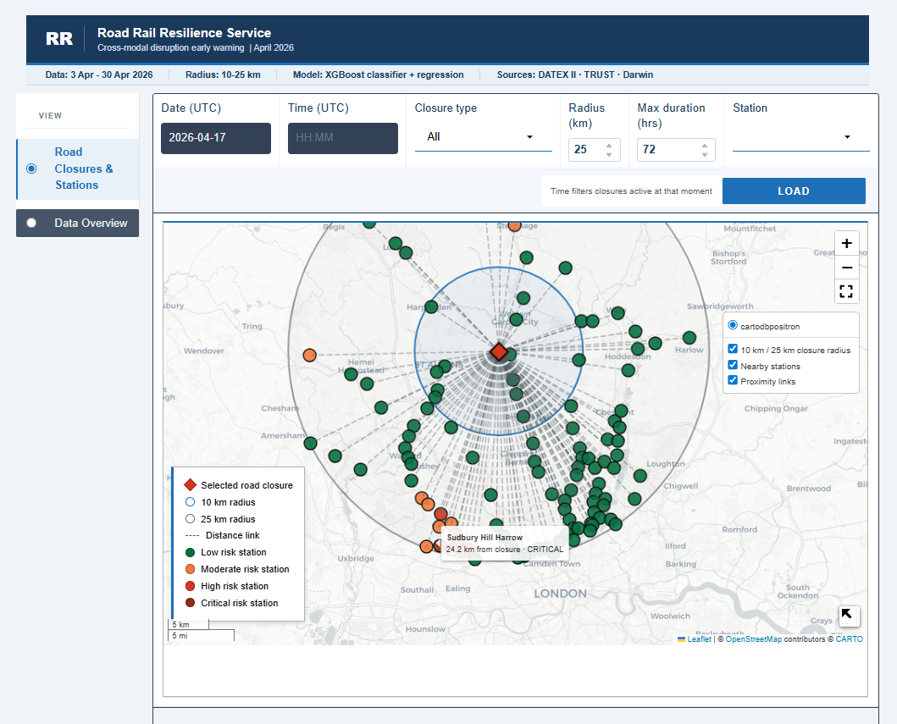

  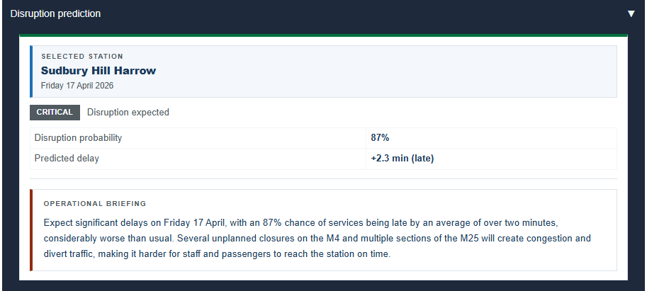

The dashboard also includes a data overview page with dataset metrics, model performance and feature importance. This is useful for explaining the model limitations to non-technical users.

  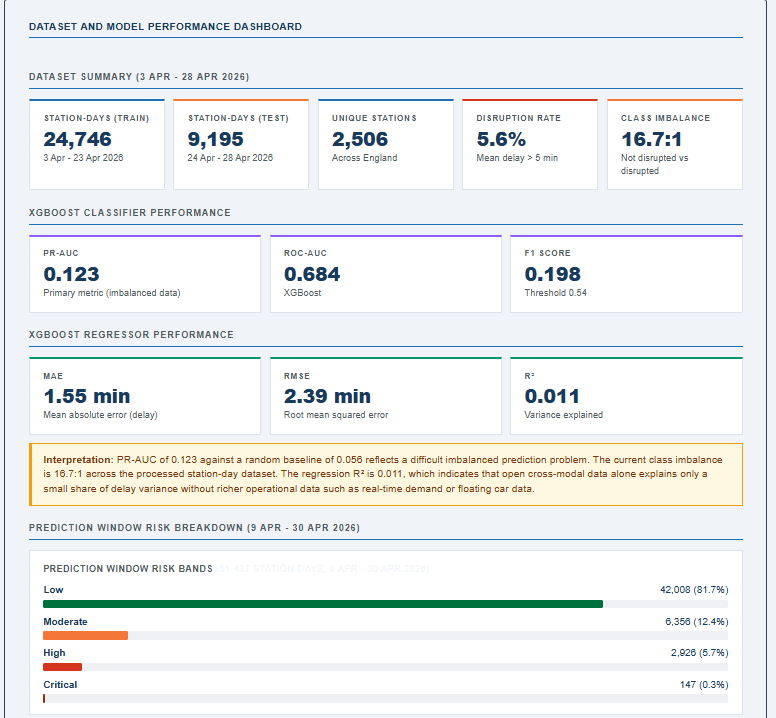

  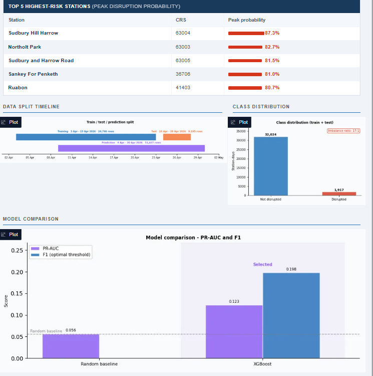

## 9. Discussion

The project successfully built a reusable open-data pipeline for road-rail integration. This is the strongest contribution. The model results are weaker, but still useful. They show that the signal exists above chance but is not strong enough for deployment.

The main limitation is not the model choice. It is the data. Eighteen days of spring data is too short to capture seasonal disruption patterns. Station-day aggregation may hide peak-hour effects. CORPUS does not resolve every rail location. Road closure centroids simplify long closures and can distort distance features. Most importantly, there is no open station-level passenger volume dataset. Without passenger demand, the model cannot distinguish a road-induced demand surge from normal variation, events, holidays or within-rail causes.

## 10. Conclusion

This project demonstrates that UK open road and rail data can be integrated into a coherent modelling pipeline. It also shows that the current station-day feature set provides only a weak predictive signal. The XGBoost classifier performs above chance, but its precision is too low for operational deployment. The regression model explains very little variation in delay magnitude.

The main conclusion is therefore balanced. The pipeline is technically successful and academically useful. The current predictive performance is limited. Future work should extend the data collection window, move to station-hour modelling and add passenger volume or observed traffic flow features. These additions would give the cross-modal hypothesis a stronger and fairer test.
