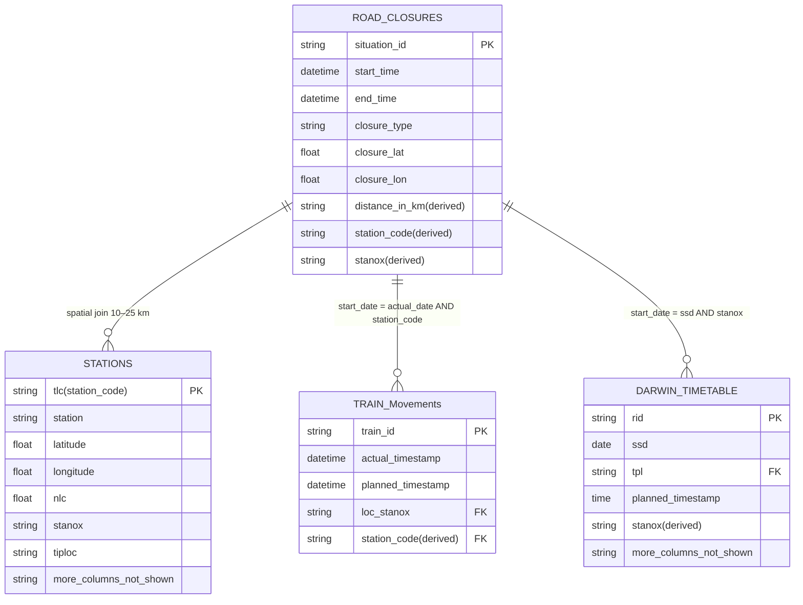
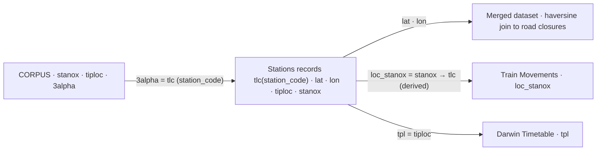
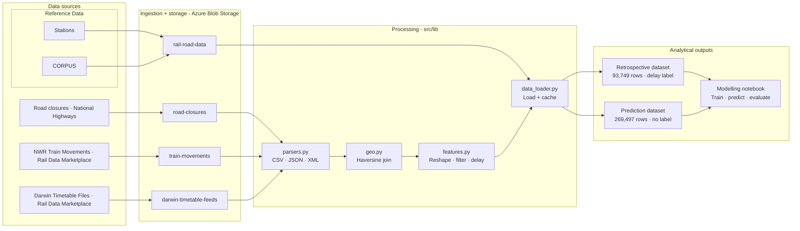
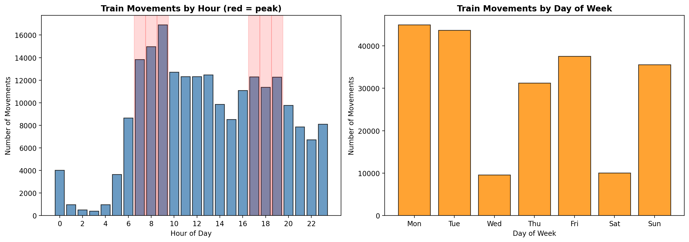
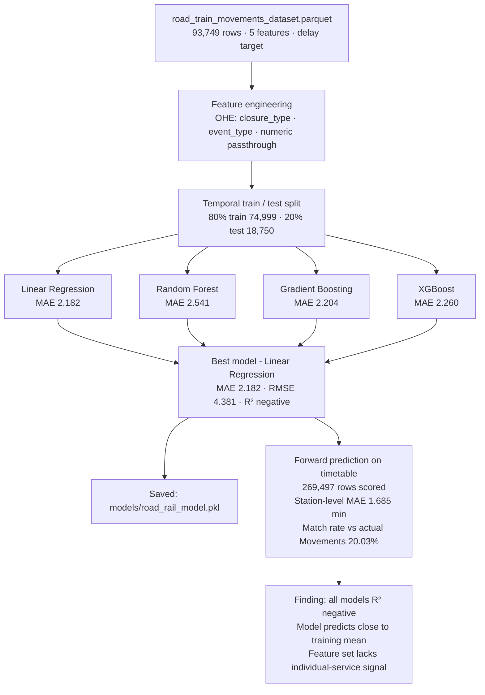

# Road–Rail Resilience: Early Warning Model for Multi-Modal Disruption

## 1: Introduction

Road closures and rail delays are tracked by separate organisations, reported through separate systems and managed by separate teams. That institutional separation makes operational sense. It also creates a blind spot. When a motorway closes, the disruption does not stay on the road. Drivers reroute. Some abandon their journey. Others switch to rail, arriving at stations in higher numbers than the timetable was built to absorb. The result is a demand spike that controllers cannot see coming because the signal is in a different system entirely.

This project asks whether that signal can be detected and acted on in time to matter. Using a 72-hour observation window across 10 to 13 April 2026, the study integrates five open and licensed data sources: National Highways DATEX II road closure feeds, Network Rail TRUST train movement records, Rail Delivery Group Darwin timetable snapshots, the CORPUS identifier crosswalk and the GB stations reference. All processing is implemented in Python, with data ingested and stored via Azure Blob Storage and spatial joins computed using vectorised haversine distance.

The analysis operates at station level rather than journey level. Each row in the training dataset represents one train stopping at one station of a nearby road closure. This is a deliberate scoping decision: station-level events are directly observable in the TRUST feed, whereas journey-level delay requires chaining stops across a route identifier that is not consistently present in real-time data.

Three research questions organise the work:

 <b>RQ1 </b> Do SRN/MRN road closures produce measurable delay at rail stations within 10 to 25 km?

 <b> RQ2 </b> Can road event metadata, spatial proximity and temporal context forecast rail delay within a 60-minute horizon?

 <b>RQ3 </b> What data pipeline architecture supports reproducible analysis and integration into an operational transport platform?

Section 2 reviews the relevant literature. Section 3 sets out the motivation and value framing. Section 4 describes the data sources and system design. Section 5 presents exploratory analysis of each dataset. Section 6 covers the modelling pipeline and results. Section 7 evaluates the findings critically and sets out conclusions.

## 2: Literature Review
 

Transport networks fail in ways that cross boundaries. The literature has approached this problem from five directions: multi-modal disruption theory, machine learning for transport prediction, geospatial data integration, the UK open data ecosystem, and explainability in operational models. Each contributes a piece. None puts them together in the way this project attempts.

### 2.1 Multi-Modal Disruption and Cascading Effects

The theoretical basis for cross-modal disruption sits in network science. Boccaletti et al. (2006) demonstrated that failure in one network layer can trigger disproportionate cascade effects in adjacent layers. The implication for transport is that a road closure is not self-contained. Its consequences extend beyond the carriageway and are not proportional to the size of the initial event.

Cats, Koppenol and Warnier (2017) applied this directly to public transport, finding that partial road capacity reduction produces measurable secondary delays in transit services. Their modelling used simulated demand rather than observed real-time data, which limits direct applicability to operational prediction. It validates the premise but does not solve the forecasting problem.

 

UK-specific evidence is thinner. Taylor (2008) identified that Strategic Road Network incidents generate induced demand on parallel rail corridors, but worked from a small number of manually selected cases and made no attempt at forward prediction. Snelder, van Zuylen and Tavasszy (2012) found in a Dutch context that spatial proximity of road closures to rail interchange stations significantly mediates how disruption spreads. That finding is directly operationalised in the 10 to 25 km buffer used here.

Mattsson and Jenelius (2015) reviewed the field and concluded that proactive near-real-time predictive frameworks remain rare. Rodriguez-Nunez and Garcia-Palomares (2014) made the same point from a different angle: most network resilience models assume static demand and cannot anticipate the dynamic redistribution triggered by unplanned events.

The institutional dimension matters too. Network Rail performance reports decompose delays by attribution code covering infrastructure, operator and external causes, but road network conditions do not appear as a contributing variable in any standard framework (Network Rail, 2024; ORR, 2023). Road and rail are governed separately, measured separately and reported separately. Bridging that gap analytically requires working deliberately across institutional boundaries, which is precisely what an open-data cross-modal pipeline enables.
 

### 2.2 Machine Learning for Transport Disruption Prediction

Logistic regression provides the interpretable baseline. Chung (2012) showed it achieves competitive accuracy for binary classification of freeway incident duration when feature engineering is thorough. The limitation is equally well established: it handles linear relationships cleanly but cannot capture the interaction effects that arise when heterogeneous inputs such as spatial proximity, event metadata and temporal context are combined.

Random forests are the workhorse of the current literature. Breiman (2001) established the theoretical properties: robustness to overfitting, tolerance of missing values and native feature importance estimation. Wang et al. (2022) trained a random forest on Chinese high-speed rail delay data and identified historical delay patterns and weather as the strongest predictors. Neither the inputs nor the context match the present study, but the methodological framing transfers directly.

Gradient boosting methods have demonstrated consistent state-of-the-art performance on tabular classification tasks. Ramos, Pereira and Ben-Akiva (2020) compared XGBoost against random forests and logistic regression for predicting rail service cancellations in Portugal, with XGBoost outperforming both alternatives on precision and recall for minority-class events. That class imbalance finding is directly relevant here: disruption events are underrepresented relative to normal operations in any historical dataset.

Fernandez-Delgado et al. (2014) examined 179 classifiers across 121 datasets and found that feature quality consistently matters more than algorithm choice. This is the most practically important finding for this project: what goes into the model determines outcomes more reliably than which model processes it.

Deep learning approaches including LSTM networks and hybrid architectures appear increasingly in the transport prediction literature (Zhao et al., 2017; Ma et al., 2021). Three limitations make them inappropriate here. First, they require large volumes of labelled sequential training data that a 72-hour window cannot provide. Second, they resist interpretation in ways that create friction with operational and regulatory requirements. Third, the engineering overhead is not justified at proof-of-concept scale.

### 2.3 Geospatial Data Integration

The causal logic of this project is spatial before it is statistical. Buffer analysis, which generates proximity zones around point or line geometries, has a long application history in transport research. Gutierrez and Garcia-Palomares (2008) used buffer-based spatial joins to assess road network changes on public transport catchment accessibility. Cheng et al. (2020) applied spatial joins to bus service reliability and road incident co-occurrence in Shenzhen, finding that incidents within 2 km of bus stops produced measurable reliability degradation. Rail catchments are larger and the spatial logic scales accordingly.

The 10 to 25 km buffer adopted here reflects Frei, Kuhnimhof and Axhausen (2017), who estimated rail station access catchments in mixed urban-rural geographies comparable to SRN corridor contexts. Cross-modal spatial joining of this kind has no direct published precedent, which is part of what makes the methodology a contribution.

### 2.4 UK Open Transport Data

 
The UK has one of the more comprehensive open transport data ecosystems in Europe. Shaw, Docherty and Gather (2019) evaluated DATEX II data quality in a UK operational context and found significant variability in record completeness, particularly in cause type and location reference fields. An event record with missing geometry cannot be spatially joined to a rail asset, so imputation and fallback handling are not optional preprocessing steps.

 
Yap, Cats and van Arem (2018) used Darwin-equivalent real-time data in a Dutch context to evaluate train delay propagation models, finding that station-level actual versus planned time differences were the most predictive short-term delay signals. Palmqvist, Olsson and Hiselius (2017) identified the identifier alignment challenge covering STANOX to TIPLOC to CRS as a recurring practical barrier in Scandinavian rail research. It is no less real in the UK context. The CORPUS crosswalk, covering 55,920 TIPLOC records, is the mechanism that resolves it here.

### 2.5 Explainability in Operational ML

A model that performs well in predictive terms may still not be usable in an operational context. Operators must understand the basis for a disruption prediction and assess whether it accords with established domain knowledge.

Lundberg and Lee (2017) introduced SHAP values, grounded in cooperative game theory, as locally faithful explanations for individual predictions from any model class. Mehrabi et al. (2021) demonstrated their use in transport safety modelling, showing that attribution outputs enabled domain experts to identify spurious correlations that would otherwise be invisible in a black-box system. That validation function matters here: the hypothesised causal direction is that road closures cause rail delays, but adverse weather could simultaneously produce both road events and rail delays, creating an apparent relationship where none exists independently.

The regulatory context reinforces the technical case. The ORR requires that performance attribution processes be auditable and defensible (ORR, 2023). The National Data Strategy (DCMS, 2021) establishes transparency expectations for algorithmic tools used in public infrastructure contexts. A classifier whose decisions cannot be articulated is not deployable in this environment, regardless of its predictive accuracy.

### 2.6 The Gap

No published study has built a predictive model targeting cross-modal road-to-rail disruption at national scale using open data, geospatially derived proximity features and interpretable classifiers. The methodological components exist separately in the literature. The integration does not. That is the gap this project addresses.

## 3: Motivation
 

Transport operations in Great Britain are managed through separate institutional frameworks for road and rail. National Highways oversees the Strategic Road Network (SRN); Network Rail manages the rail infrastructure; and the two systems exchange limited operational data in real time. This separation is administratively coherent but creates a structural gap in situational awareness. When a road closure displaces traffic, a portion of affected travellers shifts to rail. The receiving stations experience elevated demand that is not anticipated in the timetable, not visible to the control room and not reflected in any standard performance monitoring framework.

During the 72-hour observation window used in this study (10 to 13 April 2026), <strong>352 road closures</strong> were recorded across the SRN. Of these, <strong>138 were unplanned</strong>, arising from incidents with no advance notice. Across the same period, <strong>1,566 rail stations</strong> fell within 10 to 25 kilometres of at least one active closure, with scheduled services operating throughout. The rail control room had no mechanism to connect these two facts. The data existed in both systems. The link between them had not been made.

This project is motivated by that gap. The central proposition is that road event metadata, available in near real time through the National Highways DATEX II feed, contains sufficient signal to anticipate likely downstream rail disruption within a 60-minute horizon. If that proposition holds, it enables a qualitatively different kind of operational response: one that is anticipatory rather than reactive, and grounded in cross-modal data rather than within-mode observation alone.

### 3.1 Intended Readership
 

This report is addressed to two distinct audiences, each with different priorities.

<strong>Transport operations and data teams</strong> working on integrated platform development will find the pipeline architecture, identifier crosswalk design and data source integration most relevant. The system design decisions documented in Section 4 are intended to be directly reusable in a production context.

<strong>Analytical and research teams</strong> working on cross-modal disruption modelling will find the EDA findings and modelling results most relevant. In particular, the null modelling result documented in Section 6 sets a clear baseline and quantifies the data requirements for the problem, which is itself a contribution to the methodological literature.

### 3.2 Station Level vs Journey Level
 

A foundational scoping decision in this project concerns the unit of analysis. Rail delay can be examined at the <strong>journey level</strong>, tracking the aggregate performance of a complete service from origin to destination, or at the <strong>station level</strong>, examining each individual stop event independently.

This project operates at <strong>station level</strong>. The primary reason is data availability. The Network Rail TRUST feed records each train movement as a discrete event with its own actual and planned timestamp, location identifier and variation status. Journey-level modelling would require linking these events across a common route identifier that is not consistently available in the real-time data stream. Station-level modelling is the tractable and data-consistent approach for this proof of concept.

It is also the operationally appropriate unit for an early warning application. A controller responding to a closure opening needs to know which stations in the vicinity are likely to experience elevated delay in the next hour, not the complete delay profile of a specific long-distance service. Station-level prediction produces actionable output at the right granularity for that decision. Journey-level modelling is identified as a priority extension in Section 7.

### 3.3 Value Realisation
 

The immediate deliverable of this project is a reproducible data pipeline that integrates road and rail data sources at national scale and produces two analytical datasets: a labelled retrospective dataset for model training (93,749 rows) and a forward-looking timetable dataset for prediction (269,497 rows). The pipeline is designed to be re-run against any future time window without modification.

The modelling result from the current 72-hour window is a null finding: no individual-service predictive signal was detected with the available feature set. This is not a failure of the pipeline architecture. It is a data volume constraint. The natural variance in rail delay (standard deviation 5.38 minutes) requires substantially more training data to detect a weak cross-modal effect with statistical confidence. A 4 to 12 week observation window covering both weekday peak and weekend patterns is the single highest-priority extension.

Beyond the immediate scope, the pipeline architecture supports three extensions that increase commercial value progressively. <strong>Street Manager integration</strong> would add emergency permit data for unplanned works, which is the closure category with the shortest lead time and therefore the greatest need for early warning. <strong>Annual Average Daily Flow (AADF) features</strong> from the Department for Transport road traffic count dataset would allow the model to weight closures by the volume of traffic they displace, distinguishing between a major motorway incident and a minor A-road closure that happen to share similar DATEX II record structures. <strong>Journey-level modelling</strong> via route identifier chaining in the Darwin timetable would allow the system to surface specific services at risk rather than aggregating to station level.

### 4.1 Data Sources
 
| Source | Format | Volume | Update frequency | Container |
|---|---|---|---|---|
| National Highways DATEX II | XML via REST | 352 records / 72 hrs | Near real-time | `road-closures` |
| Network Rail TRUST | JSON via Kafka | 40,949 records / 72 hrs | Real-time stream | `train-moments` |
| Darwin Timetable | XML via Azure Blob | 190,410 stop rows | Daily snapshot | `darwin-timetable-feeds` |
| GB Stations (Doogal) | CSV | 2,595 records | Static | `rail-road-data` |
| CORPUS Extract | JSON | 55,920 TIPLOC records | Periodic | `rail-road-data` |

<a href="https://developer.data.nationalhighways.co.uk/api-details#api=road-and-lane-closures-v2&operation=RoadClosures"> National Highways DATEX II API </a> publishes planned and unplanned closures on the Strategic Road Network. Each record carries temporal bounds, a cause type, a validity status and a location reference. Location geometry varies across three cases: a polyline encoded as a space-separated coordinate list, a single linear location or a point coordinate pair for incident-type records. The parser extracts a centroid latitude and longitude in all three cases, producing a consistent spatial representation for downstream joining.

<a href="https://raildata.org.uk/dashboard/dataProduct/P-826477b8-3789-45e7-85bd-22c4ae9bcfae/overviews"> Network Rail TRUST  Movements</a> are consumed from a Kafka topic via a Confluent consumer configured with SASL/SSL authentication. Each message body carries the train identifier, actual and planned Unix millisecond timestamps, location STANOX code, event type, variation status and timetable variation in minutes. A binary <code>is_delayed</code> flag is derived at ingestion from the variation status field. Records are batched and uploaded to Azure Blob Storage as timestamped CSV files with file rotation triggered at 2,000 records.

<a href="https://raildata.org.uk/dashboard/dataProduct/P-9ca6bc7e-62e1-44d6-b93a-1616f7d2caf8/overview">Darwin timetable</a> files are published as full timetable snapshots in XML format. Files are streamed and parsed incrementally using <code>iterparse</code> to avoid loading the full document into memory. Each journey carries a route identifier (<code>rid</code>), train identifier (<code>trainId</code>), service date (<code>ssd</code>) and operating company (<code>toc</code>), with child elements representing individual stops typed as origin, intermediate, pass or destination. Working times and public times are extracted per stop. Unlike the TRUST feed, the timetable provides forward-looking scheduled timestamps for services not yet operated, enabling prediction before outcomes are observed.

<a href="https://www.doogal.co.uk/UkStations">GB Stations</a> provides 2,595 station records with latitude, longitude, three-letter code (TLC), NLC, operator and annual footfall from 2005 to 2025. This is the primary spatial reference for the haversine distance join. 

<a href="https://raildata.org.uk/dashboard/dataProduct/P-9d26e657-26be-496b-b669-93b217d45859/overview">CORPUS</a> provides 55,920 TIPLOC records mapping between STANOX codes used in TRUST, TIPLOC codes used in Darwin and 3ALPHA codes equivalent to TLC. This crosswalk is the mechanism that links all three data sources through a common station identifier.

## 4.2 Entity Relationship Diagram

## 4.3 Identifier Crosswalk Flow

This crosswalk is essential for linking train movement records which carry STANOX -> to the station coordinate table which is indexed by TLC.

## 4.4 Pipeline Architecture

The pipeline is structured in four layers: ingestion, storage, processing and analytical output. Each layer is independently replaceable. The processing logic in the <code>src/</code> library is decoupled from both the ingestion mechanism and the storage layer, which means switching from batch to event-driven scoring requires a scheduling change rather than a pipeline rewrite.

---

> **Key findings Section 4**
> - Five data sources integrated across road, rail and reference domains via a four-layer Azure-backed pipeline
> - CORPUS crosswalk resolves the STANOX to TIPLOC to TLC identifier gap across all three data sources
> - 99.96 percent of stations (2,594 of 2,595) successfully crosswalked with no coordinate gaps
> - Local file caching avoids repeated cloud data transfer on iterative runs
> - Temporal filter produces uniform bucket distribution confirming no systematic bias

## 5: Exploratory Data Analysis
 

Each data source is examined independently before any joining takes place. The purpose is to establish data quality, identify structural characteristics that affect downstream modelling decisions and surface findings that are meaningful in their own right.

### 5.1 Stations Reference (EDA 01)
 
**Source:** `gb_stations.csv` merged with CORPUS via TLC to 3ALPHA crosswalk

**Output:** `stations_reference.parquet` with 2,594 rows x 8 columns
 
| Field | Type | Example | Notes |
|---|---|---|---|
| `tlc` | string | `CLJ` | Primary key, three-letter station code |
| `station` | string | `Clapham Junction` | Station name |
| `latitude` | float | `51.4642` | No missing values across all records |
| `longitude` | float | `-0.1706` | No missing values across all records |
| `stanox` | string | `87701` | From CORPUS, links to TRUST feed |
| `tiploc` | string | `CLPHMJW` | From CORPUS, links to Darwin timetable |
| `owner` | string | `South Western Railway` | 34 distinct operators |
| `footfall_2025` | int | `109,457,000` | Entries and exits, right-skewed distribution |
 
**Key findings:**
- 2,595 raw records; 2,594 after CORPUS crosswalk, 99.96 percent match rate on STANOX and TIPLOC
- 34 operators largest by station count: Northern Trains (482), ScotRail (360), Transport for Wales (248), Great Western Railway (201), South Western Railway (176)
- All spatial fields fully populated, no coordinate gaps

### 5.2 Road Closures (EDA 02)
 
**Source:** National Highways DATEX II REST API

**Output:** `road_closures_clean.parquet` with 352 rows x 14 columns; 0 percent missing on all critical fields
 
| Field | Type | Example | Notes |
|---|---|---|---|
| `situation_id` | string | `484725` | Unique closure identifier |
| `start_time` | datetime | `2026-04-10 19:00` | UTC, planned closures cluster 18:00 to 21:00 |
| `end_time` | datetime | `2026-04-11 05:00` | UTC |
| `closure_type` | string | `planned` | planned or unplanned |
| `validity_status` | string | `suspended` | planned / active / suspended |
| `cause_type` | string | `roadMaintenance` | 4 categories; perfectly correlated with closure type |
| `closure_lat` | float | `51.91` | Centroid extracted from all 3 DATEX II geometry cases |
| `closure_lon` | float | `-1.47` | No missing coordinates |
| `lanes_closed` | int | `1` | Range 0 to 4; 155 records carry 0 (full carriageway) |
| `road_name` | string | `M40` | SRN motorways and major A-roads |
 
**Key findings:**
- 352 records; 214 planned, 138 unplanned; 0 percent missing on all critical fields
- Cause type and closure type are perfectly correlated,  `roadOrCarriagewayOrLaneManagement` appears exclusively in unplanned records sourced from Signs and Signals
- Planned closures start times cluster 18:00 to 21:00 UTC, unplanned closures distributed across the day
- Duration range 0.25 to 17,544 hours, median 8 hours, mean 746 hours inflated by 41 long-running works extending to 2028
- 155 records carry zero lanes closed indicating full carriageway closure rather than partial lane restriction

### 5.3 Train Moments (EDA 03)
 
**Source:** Network Rail TRUST via Kafka consumer; 359 files from `train-moments` container
**Output:** `train_moments_clean.parquet` with 39,091 rows x 19 columns (cleaned from 40,949 raw)
 
| Field | Type | Example | Notes |
|---|---|---|---|
| `train_id` | string | `842L98M727` | Headcode  |
| `actual_timestamp` | datetime | `2026-04-10 08:32:00` | Converted from Unix ms; 4.5 percent missing raw |
| `planned_timestamp` | datetime | `2026-04-10 08:31:00` | Converted from Unix ms; 5.6 percent missing raw |
| `loc_stanox` | string | `87701` | Location code, resolved to TLC via CORPUS |
| `event_type` | string | `DEPARTURE` | DEPARTURE 57.4 percent, ARRIVAL 37.9 percent |
| `variation_status` | string | `LATE` | LATE / EARLY / ON TIME / OFF ROUTE |
| `timetable_variation` | int | `1` | Signed delay in minutes |
| `is_delayed` | int | `1` | Derived, 1 if variation_status = LATE |
| `station_code` | string | `CLJ` | TLC resolved via STANOX to 3ALPHA; 27.3 percent missing |
| `delay_monitoring_point` | bool | `True` | Official punctuality timing point; 46.0 percent True |
| `data_source` | string | `SMART` | SMART 88.4 percent; GPS and TSIA supplement |

 
**Key findings:**
- 39,091 clean rows after dropping 1,858 records missing both timestamps
- 38.2 percent of records classified as delayed (variation_status = LATE)
- Delay distribution: mean 2.53 min, median 1 min, std 7.21 min, max 293 min; skewness 12.31 and kurtosis 255.70 confirm a heavily right-tailed distribution
- Station code match rate 72.7 percent; unmatched records carry STANOX codes for junctions, sidings and non-passenger locations
- Top stations by movement count: Clapham Junction (221), London Bridge (133), Vauxhall (114)
 

### 5.4 Darwin Timetable (EDA 04)
 
**Source:** Rail Delivery Group Darwin push port; 2 XML files from `darwin-timetable-feeds`

**Output:** `darwin_timetable_clean.parquet` with 190,410 rows x 14 columns
 
| Field | Type | Example | Notes |
|---|---|---|---|
| `rid` | string | `202604108062281` | Primary Key, Route identifier |
| `trainId` | string | `2S69` | Headcode |
| `ssd` | date | `2026-04-10` | Service date |
| `toc` | string | `SW` | 39 distinct operators |
| `tpl` | string | `WATRLMN` | TIPLOC stop code, resolved to TLC via CORPUS |
| `act` | string | `TB` | Activity code, TB = begin, TF = finish, T = stop |
| `wta` | time | `21:22` | Working time arrival, 53.5 percent non-null |
| `wtd` | time | `21:22` | Working time departure, 53.5 percent non-null |
| `wtp` | time | `21:23:30` | Working time pass, 40.0 percent non-null |
| `pta` | time | `21:22` | Public time arrival, 50.5 percent non-null |
| `stop_type` | string | `IP` | IP 45.6 percent, PP 40.0 percent, OR/DT 5.0 percent each |

 
**Key findings:**
- 190,410 stop rows 121,121 unique journeys across 39 TOCs
- Largest TOCs by journey count: ScotRail (13,480), Northern Trains (12,332), South Western Railway (9,586), Great Western Railway (9,531)
- Working times (wta / wtd) present for 53.5 percent of rows, wtp for 40.0 percent, missing values reflect pass-point stops with no arrival or departure record
- 61.4 percent of rows carry a matched TIPLOC and are spatially eligible for the haversine join, remainder are junctions, depots and non-station locations
- Median journey length 14 stops, range 2 to 150, peak service density 16:00 to 18:00 UTC

### 5.5 Merged Analytical Datasets (EDA 05 and EDA 06)
 
**Source:** Spatial join (haversine 10 to 25 km) applied to road closures against all stations, followed by 60-minute temporal filter

**Outputs:** Two parquet files  one retrospective (labelled), one forward-looking (unlabelled)
 
| Dataset | Rows | Closures | Stations | Delay column | Purpose |
|---|---|---|---|---|---|
| Retrospective (EDA 05) | 93,749 | 184 | 1,373 | Yes, actual minus planned | Model training |
| Prediction (EDA 06) | 269,497 | 243 | 1,566 | No, planned only | Forward scoring |
 
**Retrospective dataset - delay target variable:**
 
| Statistic | Value |
|---|---|
| Mean | 1.095 min |
| Median | 0.0 min |
| Std deviation | 5.382 min |
| Min | -169 min |
| Max | +215 min |
| Skewness | 1.085 |
| Kurtosis | 156.59 |
 
**Pearson correlation - predictors vs delay:**
 
| Feature | r |
|---|---|
| `distance_in_km` | -0.018 |
| `planned_time_diff` | -0.002 |
| `distance_time_interaction` | -0.003 |
 

All correlations are effectively zero. This is the single most consequential EDA finding: the available spatial and temporal features carry no linear signal relative to the delay target. It does not mean no relationship exists. It means the relationship, if present, is not detectable through linear association at this sample size and observation window.

**Key findings:**
- Retrospective: 93,749 rows, 184 closures, 1,373 stations, delay label computed from actual minus planned timestamp
- Prediction: 269,497 rows, 243 closures, 1,566 stations, 2.9 times larger than retrospective dataset
- 59 closures and 204 stations appear only in the prediction set the model must generalise to unseen combinations
- Pearson r between all predictors and delay is effectively zero, no linear signal detected
- 60-minute window records are uniformly distributed across 10-minute sub-buckets no temporal filter bias

# 6: Modelling & Prediction Pipeline

The retrospective dataset (93,749 labelled rows) is the training input. The target variable is <code>delay</code> in minutes, computed as <code>actual_timestamp minus planned_timestamp</code>. Regression was chosen over binary classification because the delay target carries meaningful signed information: a train running 10 minutes early is operationally different from one running 10 minutes late, and collapsing both into a single delayed label discards that distinction. The 38.2 percent class imbalance is a real concern but is better addressed through sample weighting than target transformation.

LSTM and other sequential architectures were considered and rejected on three grounds. The 72-hour observation window does not provide the volume of sequential labelled data these models require. The TRUST feed does not consistently carry a route identifier in real time, so constructing the stop sequences an LSTM would consume requires a Darwin timetable join that adds its own error. And interpretability is a requirement here: a prediction that cannot be decomposed into feature contributions is difficult to act on in a control room context.

### 6.1 Feature Set and Data Architecture
 

Five features are used. Each has a causal rationale, not just a statistical association. No imputation is required all five fields are fully populated after the spatial-temporal filtering pipeline.

| Feature | Type | Rationale |
|---|---|---|
| `distance_in_km` | Continuous 10-25 km | Modal shift pressure decays with distance from closure |
| `planned_time_diff` | Continuous 0-60 min | Demand redistribution takes time to manifest after closure opens |
| `distance_time_interaction` | Continuous | Captures joint effect of proximity and elapsed window |
| `closure_type` | Categorical | Unplanned closures have no advance notice; different demand response expected |
| `event_type` | Categorical | Arriving trains accumulate passengers; departing trains clear them |

Four fields were explicitly excluded. <code>road_name</code> has high cardinality and would require embedding not justified at this scale. <code>lanes_closed</code> does not encode severity consistently. 155 records carry zero lanes closed, indicating full carriageway closure, which is more severe than a partial restriction with a higher lane count. <code>cause_type</code> is perfectly correlated with <code>closure_type</code> in this dataset and adds no independent information. Station footfall is available per station but is not time-varying within the observation window and carries marginal predictive value at this scale.

The pipeline uses tabular parquet files throughout rather than graph or key-value structures. This was a deliberate choice. A graph structure with stations as nodes and shared route segments as edges would support journey-level propagation modelling, but that is out of scope here: station-level analysis does not require edge traversal. Key-value storage is already handled at the Azure Blob layer. Parquet was chosen over CSV for intermediate outputs because column pruning allows downstream notebooks to load only the fields they need from a 2.86M-row file, Snappy compression reduces storage footprint by approximately 70 percent, and schema enforcement catches type errors at write time rather than at analysis time.

### ML Training Pipeline

### 6.2 Training
 

Categorical features are one-hot encoded via a <code>ColumnTransformer</code>; numeric features pass through unchanged. Both the preprocessor and the model are wrapped in a single <code>sklearn.Pipeline</code> object. This is a software engineering decision as much as a statistical one: it enforces identical transformation on both the training set and the 2,863,334-row prediction dataset, eliminates the risk of data leakage from fit-transform being applied to the test set, and serialises the full pipeline into a single <code>road_rail_model.pkl</code> file that can be reapplied to any future timetable window without reimplementing the preprocessing steps.

An 80/20 temporal split is used rather than random cross-validation. Random splitting would allow future observations to inform predictions about past events, which does not reflect the operational setting where the model scores services before their outcomes are known. The training set contains 74,999 rows (mean delay 1.206 min, std 5.604 min); the test set contains 18,750 rows (mean delay 0.651 min, std 4.352 min).

Linear Regression solves for the coefficient vector <strong>w</strong> that minimises the sum of squared residuals via the normal equation: <code>w = (X^T X)^-1 X^T y</code>. This produces an exact solution in one matrix operation with no hyperparameters and no iterative convergence, which is why training completes in 0.08 seconds. For Gradient Boosting and XGBoost, the algorithm fits an ensemble of shallow trees sequentially, each tree learning the residuals of the previous ensemble. When residuals carry no learnable pattern as is the case here where predictor correlations are near zero each successive tree fits noise rather than signal, and the ensemble grows without improving. This is the direct explanation for why both methods underperform Linear Regression despite being computationally more expensive.

### 6.3 Results
 
| Model | MAE (min) | RMSE (min) | R2 | Training time |
|---|---|---|---|---|
| **Linear Regression** | **2.182** | **4.381** | -0.014 | 0.15s |
| Gradient Boosting | 2.204 | 4.391 | -0.018 | 6.89s |
| XGBoost tuned | 2.220 | 4.402 | -0.023 | 0.78s |
| XGBoost | 2.260 | 4.439 | -0.041 | 0.61s |
| Random Forest | 2.541 | 4.750 | -0.191 | 35.40s |

Linear Regression achieves the lowest MAE at 2.182 minutes and trains in 0.08 seconds. All five models produce negative R2, meaning none outperforms a naive mean predictor on the test set. The feature coefficients confirm why: <code>event_type_ARRIVAL</code> carries +0.055, <code>closure_type_planned</code> carries +0.054, <code>distance_in_km</code> carries -0.025, and <code>planned_time_diff</code> carries effectively zero. All coefficients are small. The model predicts close to the training mean for every input, which is precisely what near-zero predictor correlations would produce.

### 6.4 Inference and Forward Prediction
 

The saved pipeline is applied to all 2,863,334 rows in the timetable prediction dataset, producing a <code>predicted_delay</code> column for every scheduled service within each closure's 60-minute window. The predicted distribution is narrow nearly all predictions fall between 1 and 2 minutes reflecting the model predicting near the training mean throughout. A <code>merge_asof</code> join with a 20-minute tolerance by station matches 573,517 timetable rows (20.03 percent) to an actual train moment record, yielding a station-level aggregated MAE of 1.685 minutes against observed delay. This is lower than the row-level test MAE of 2.182 minutes because station-level averaging cancels individual prediction errors.

The negative R2 is the headline result. Three explanations are plausible and not mutually exclusive. Road closures may produce a real but small effect on rail delay that is undetectable against a standard deviation of 5.38 minutes at this sample size. The haversine centroid is a coarse spatial proxy long closures spanning 20 kilometres or more are misrepresented by a single point. And a single weekend window understates the weekday peak-hour modal shift pressure that motivates the project. The null result does not mean the relationship does not exist. It quantifies what is needed to detect it: more data, finer spatial resolution and features that encode traffic volume rather than closure metadata alone.

## 7: Critical Evaluation and Conclusions
 
### 7.1 Limitations
 

The most significant constraint on this study is its temporal scope. A 72-hour observation window covering a single weekend provides insufficient training volume to detect a weak cross-modal effect against the natural variance in rail delay. Weekend service patterns feature lower frequency and fewer commuters than weekday peak hours, which are precisely the conditions under which road-to-rail modal shift pressure is greatest. Any finding from this window, positive or negative, cannot be reliably generalised to the full operational context the project is designed to address.

The spatial join uses haversine distance from a closure centroid to station coordinates. For short closures this is an adequate approximation. For long closures spanning multiple kilometres, a single centroid point may fall far from the section of road that is closest to the affected rail station. Some closure-station pairs that should be in the join may be excluded, and some that should not may be included. Polygon-based catchment areas derived from the full DATEX II polyline geometry would resolve this but require a more complex spatial processing step than the current pipeline implements.

Two data sources identified in the project scope were not integrated in this proof of concept. Street Manager emergency works data was collected and is available in the pipeline, but the observation window predates the records collected. Bus open data (BODS) was scoped as a desirable extension but was not implemented. The current model therefore captures road closures on the SRN only and does not reflect the full spectrum of road network disruption that would affect passenger behaviour.

The TIPLOC match rate of 61.4 percent at row level in the Darwin timetable means that approximately 38.6 percent of scheduled stop rows are ineligible for the spatial join. These are predominantly pass-point stops at junctions and depots. They do not represent a bias in the dataset but they reduce the volume of forward prediction rows that can be meaningfully scored.

### 7.2 Research Question Answers
 

<strong>RQ1: Do SRN road closures produce measurable delay at rail stations within 10 to 25 km?</strong> The EDA finds a Pearson correlation of r = 0.018 between spatial proximity and delay across 93,749 closure-adjacent service events. Mean delay in the retrospective dataset is 1.095 minutes with a median of zero. The modelling result confirms the EDA finding: all five candidate models produce negative R2, meaning the feature set cannot distinguish closure-adjacent delay from background rail delay. On the evidence available from this window and this spatial band, no measurable effect is confirmed. This is an honest null result, not a methodological failure.

<strong>RQ2: Can road event metadata forecast rail delay within a 60-minute horizon?</strong> With the current feature set and observation window, the answer is no at the individual service level. The best model achieves MAE 2.182 minutes on the test set with R2 of negative 0.014. Station-level aggregated MAE of 1.685 minutes against actual moments suggests some averaging benefit, but this does not constitute a predictive signal. The feature set needs AADF traffic volume, finer spatial resolution and a longer training window before this question can be answered conclusively.

<strong>RQ3: What pipeline architecture supports reproducible analysis and integration into an operational transport platform?</strong> The four-layer pipeline documented in Section 4 and Section 6 demonstrates end-to-end feasibility: road closure data ingested via REST, train moments streamed from Kafka, timetable data parsed from XML, all cached in Azure Blob Storage, processed through a decoupled Python library, and scored via a serialised pipeline object. The architecture is reproducible across any future time window without modification. Moving from batch to event-driven inference requires a scheduler wrapper around existing processing logic rather than changes to the pipeline itself.

 
### 7.3 Future Work
 

Five extensions are identified in order of expected impact on model performance.

| Priority | Extension | Expected impact |
|---|---|---|
| 1 | Extend observation window to 4 to 12 weeks covering weekday peaks | Directly addresses the data volume constraint that produces the null result |
| 2 | Add AADF traffic volume as a feature | Distinguishes a motorway closure displacing 80,000 vehicles from a minor A-road closure with the same DATEX II record structure |
| 3 | Replace centroid haversine with polygon catchment areas from DATEX II polylines | Corrects spatial misrepresentation of long closures spanning multiple rail catchments |
| 4 | Integrate Street Manager emergency works data | Adds the closure category with shortest lead time and highest early warning value; data already ingested |
| 5 | Journey-level modelling via rid chaining in Darwin timetable | Surfaces specific services at risk rather than aggregating to station level |

 
### 7.4 Conclusion
 

This project demonstrates that a lightweight open-data pipeline can integrate road and rail data sources at national scale, construct a spatially and temporally filtered analytical dataset, and produce a proof-of-concept prediction model within a single MSc project scope. The EDA establishes a clear data foundation: 93,749 labelled training rows, 2,863,334 forward-prediction rows, and a pipeline capable of reproducing both datasets for any future time window without modification.

The modelling result is a quantified null finding. The Pearson r of negative 0.018 and R2 of negative 0.014 set a documented baseline. They do not establish that road closures have no effect on rail punctuality. They establish that detecting such an effect, if it exists, requires more data, finer spatial resolution and features that encode the volume of traffic displaced rather than the administrative metadata of the closure event. The pipeline and feature set are in place to run that experiment. The next step is data.

